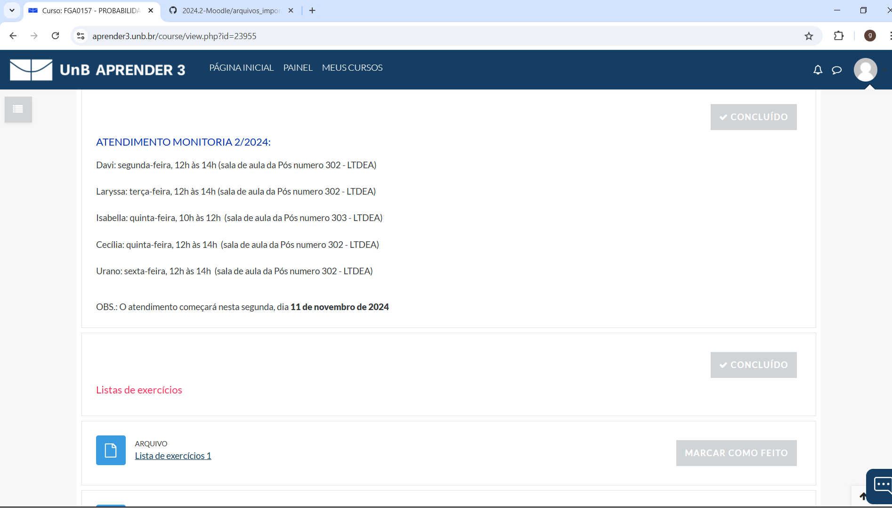

# Análise de Interface de Usuário

## Introdução

Análise de interface de usuário (*User interface analysis*), de acordo com [Wiegers et. al (2013)](https://aprender3.unb.br/pluginfile.php/2972451/mod_resource/content/1/Elicitacao%20de%20Req.pdf), é uma técnica de elicitação independente na qual se estuda sistemas existentes para descobrir requisitos de usuário e requisitos funcionais. Pode se usar *prints* para seu estudo. A análise da interface de usuário (IU) pode ajudar a identificar uma lista completa de telas para descobrir potenciais funcionalidades.

## Planejamento e Metodologia

Tendo em vista os [perfis de usuários](./Perfil%20dos%20Usuarios.md#perfis-de-usuario-do-projeto) elaborados pela equipe para o sistema Moodle, foi definido que, para realizar a técnica de análise de interface, buscaríamos ao menos um aluno e um monitor para ver como o app se diferencia entre eles, considerando também, se possível, a análise de interface de um tipo de usuário no Moodle equivalente ao 'Professor' deste projeto. O cronograma de atividades referentes à análise de interfaces pode ser visto na tabela 1, a seguir. 

Como não havia um monitor no grupo, foi contatada uma monitora na Faculdade de Ciência e Tecnologia em Engenharias (FCTE) que tinha acesso à disciplina, com a qual foram fotografadas as telas do Moodle pelo Aprender3. 

| Dia     | Atividade                  | Participantes           | 
|---------|----------------------------|-------------------------|
| 18/11   | Planejamento da realização da análise de interfaces | Laís Cecília, Rodrigo Orlandi | 
| 20/11   | Realização da análise de interface - Aluno  | Laís Cecília, Rodrigo Orlandi | 
| 22/11   | Realização da análise de interface - Monitor  | Laís Cecília, Rodrigo Orlandi | 
| 23/11   | Revisão e correção do artefato  | Laís Cecília, Rodrigo Orlandi | 
/// caption | <
Tabela 1 — Cronograma planejado das atividades referentes à análise de interfaces
///
/// caption
Fonte: Rodrigo Orlandi
///

## Execução - Análise de Interface

Durante a execução da análise de interface, houve dois contratempos notáveis:
* A equipe tentou entrar em contato com um professor, porém, devido a imprevistos em outras partes do projeto, não foi possível realizar a análise de interface do tipo de usuário 'Professor';
* Infelizmente, dentro das turmas do Moodle na FCTE ao qual tivemos acesso, nenhum instrutor fazia uso das funcionalidades especiais do Moodle para monitores, com o sistema apresentando funcionalidades equivalentes ao utilizado pelo usuário do tipo 'Aluno'.

## Interfaces - Aluno/Monitor

Como dito anteriormente, as interfaces analisadas do monitor não contém nenhuma diferença funcional ou visual, pois mesmo a aluna sendo considerada monitora, o acesso dela ao Aprender3 é o mesmo do tipo de usuário "Aluno". Por conseguinte, a função de monitor no caso desta aluna não provém mudanças no sistema. As figuras 1-8 representam as interfaces da tela da monitora no Aprender3, a seguir.

**Figura 1**. Print da tela pós-login do framework Moodle pelo Aprender3. **Fonte:** Autores (print).
 

**Figura 2**. Print da tela principal, de atividades recentes e disciplinas cadastradas, do framework Moodle pelo Aprender3. **Fonte:** Autores (print).
 

**Figura 3**. Print da tela de uma atividade do framework Moodle pelo Aprender3. **Fonte:** Autores (print).
 

**Figura 4**. Print da tela inicial de uma disciplina do framework Moodle pelo Aprender3. **Fonte:** Autores (print).
 

**Figura 5**. Print da tela inicial de uma disciplina do framework Moodle pelo Aprender3. **Fonte:** Autores (print).
 

**Figura 6**. Print da tela inicial de uma disciplina, listando as atividades em tópicos, do framework Moodle pelo Aprender3. **Fonte:** Autores (print).
 

**Figura 7**. Print da tela inicial de uma disciplina, listando as atividades em tópicos, do framework Moodle pelo Aprender3. **Fonte:** Autores (print).
 

**Figura 8**. Print representando o tipo de conteúdo que pode ser enviado ao Moodle. **Fonte:** Autores (print).
 

## Requisitos Elicitados

Para verificar o que o Moodle poderia implementar, foram analisados apps que podem ser considerados concorrentes em termos de funcionalidades. Os apps analisados o **Google Classroom** e o **Microsoft Teams**. Na tabela 2, a seguir, estão os requisitos elicitados pela análise de interface. As tabelas 3 e 4, a seguir, representam os requisitos notáveis das plataformas concorrentes.

=== "Moodle"

    Como interface de estudo para o Moodle, foi utilizada a ferramenta Aprender3.

    | Número  | Tipo de Requisito          | Descrição do Requisito  |  Foi implementado?  |
    |---------|----------------------------|-------------------------|---------------------|
    | ANA01   |  Requisito Funcional       |  O sistema requer login do usuário para acessar | SIM |
    | ANA02   |  Requisito Funcional       |  O sistema permite que alunos visualizem os materiais da turma| SIM |
    | ANA03   |  Requisito Funcional       |  O sistema permite que alunos baixem os materiais da turma| SIM |
    | ANA04   |  Requisito Funcional       |  O sistema permite que alunos visualizem a agenda de atividades | SIM |
    | ANA05   |  Requisito Funcional       |  O sistema permite que alunos visualizem as turmas em que estão cadastrados| SIM |
    | ANA06   |  Requisito Funcional       |  O sistema disponibiliza um fórum para conversa entre alunos e professores | SIM |
    | ANA07   |  Requisito Funcional       |  O sistema permite que alunos façam upload de tarefas | SIM |

    /// caption | <
    Tabela 2 — Requisitos extraídos do Moodle.
    ///
    /// caption
    Fonte: autores
    ///

=== "Google Classroom"

    Foi feita uma análise do Google Classroom como competidor do moodle. Essa análise foi feita a partir da interface de usuário aluno.

    | Número  | Tipo de Requisito          | Descrição do Requisito  |  Foi implementado no Moodle?  |
    |---------|----------------------------|-------------------------|---------------------|
    | ANA08   |  Requisito Funcional       |  O sistema requer login do usuário para acessar | SIM |
    | ANA09   |  Requisito Funcional       |  O sistema permite que alunos visualizem os materiais da turma| SIM |
    | ANA10   |  Requisito Funcional       |  O sistema permite que alunos baixem os materiais da turma| SIM |
    | ANA11   |  Requisito Funcional       |  O sistema permite que alunos visualizem a agenda de atividades | SIM |
    | ANA12   |  Requisito Funcional       |  O sistema permite que alunos visualizem as turmas em que estão cadastrados| SIM |
    | ANA13   |  Requisito Funcional       |  O sistema permite que alunos visualizem as turmas em que já foram cadastrados (arquivadas) | NÃO |
    | ANA14   |  Requisito Funcional       |  O sistema disponibiliza um fórum para conversa entre alunos e professores | SIM |
    | ANA15   |  Requisito Não Funcional   |  A navegação deve ser símples e centralizada | NÃO |
    | ANA16   |  Requisito Funcional       |  O sistema permite que alunos façam upload de tarefas | SIM |
    /// caption | <
    Tabela 3 — Requisitos extraídos do Google Classroom
    ///
    /// caption
    Fonte: autores
    ///
=== "Microsoft Teams"

    Foi feita uma análise do Microsoft Teams como competidor do moodle. Essa análise foi feita a partir da interface de usuário aluno.

    | Código  | Tipo de Requisito          | Descrição do Requisito  |  Foi implementado no Moodle?  |
    |---------|----------------------------|-------------------------|---------------------|
    | ANA16   |  Requisito Funcional       |  O sistema requer login do usuário para acessar | SIM |
    | ANA17   |  Requisito Funcional       |  O sistema permite a realização de aulas síncronas por chamas de vídeo | NÃO |
    | ANA18   |  Requisito Funcional       |  O sistema permite que alunos visualizem a agenda de atividades | SIM |
    | ANA19   |  Requisito Funcional       |  O sistema permite que alunos visualizem as turmas em que já foram cadastrados (arquivadas) | NÃO |
    | ANA20   |  Requisito Funcional       |  O sistema permite que alunos visualizem as turmas em que estão cadastrados| SIM |
    | ANA21   |  Requisito Funcional       |  O sistema permite que alunos visualizem os materiais da turma| SIM |
    | ANA22   |  Requisito Funcional       |  O sistema permite que alunos baixem os materiais da turma| SIM |
    | ANA23   |  Requisito Funcional       |  O sistema permite que alunos façam upload de tarefas | SIM |
    | ANA24   |  Requisito Funcional       |  O sistema disponibiliza as notas do usuário | SIM |
    | ANA25   |  Requisito Funcional       |  O sistema integra outros aplicativos da mesma família para uso da turma | NÃO |
    | ANA26   |  Requisito Funcional       |  O sistema disponibiliza um fórum para conversa entre alunos e professores | SIM |
    | ANA27   |  Requisito Funcional       |  O sistema permite que usuários conversem por chats privados | SIM |
    /// caption | <
    Tabela 4 — Requisitos extraídos do Microsoft Teams
    ///
    /// caption
    Fonte: autores
    ///

---

## Referências

| # | Fonte |
|---|:------|
| 1 | WIEGERS, Karl; BEATTY, Joy. **Software Requirements**. Pearson Education. 3 ed. 2013. 121p - 129p. Seção disponível em:(https://aprender3.unb.br/pluginfile.php/2972451/mod_resource/content/1/Elicitacao%20de%20Req.pdf)[https://aprender3.unb.br/pluginfile.php/2972451/mod_resource/content/1/Elicitacao%20de%20Req.pdf]. Acesso em: 22/11/2024|  

## Histórico
| Versão | Descrição                  | Autor                           | Revisor                  |                 Revisado          | Data       |
|--------|----------------------------|---------------------------------|--------------------------|-----------------------------------|------------|
| v1.0   | Página Criada              | Laís Cecília, Rodrigo de Andrade| Esther Sousa                        | <input type="checkbox" onclick="return false;" disabled checked/> | 22/11/2024 |
| v1.1   | Requisitos de competidores | Júlia Lopes, Laís Cecília       | Rodrigo Orlandi                        | <input type="checkbox" onclick="return false;" disabled checked/> | 23/11/2024 |