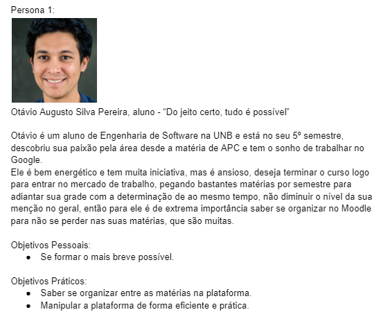
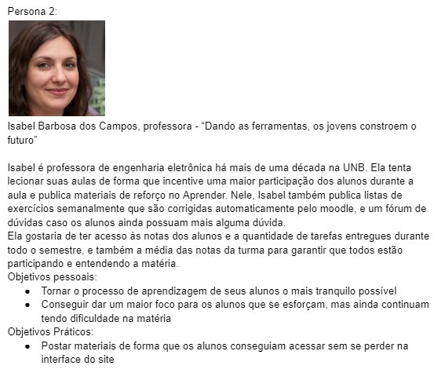

# Personas
---

De acordo com [Simone Barbosa, et al. (2021)](https://aprender3.unb.br/pluginfile.php/2972437/mod_resource/content/2/ihc-ux-%20Personas.pdf), uma **persona** “é um personagem fictício, arquétipo
hipotético de um grupo de usuários reais, criada para descrever um usário típico”, e são
definidas “principalmente por seus objetivos, determinados num processo de
refinamentos sucessivos durante a investigação inicial do domínio de atividade do usuário”. Em outras palavras, o objetivo das personas é guiar o entendimento do perfil de usuário pela equipe, que desenvolverá o sistema com os objetivos abstraídos
dos usuários em mente. 

Dentro do tópico, incluem-se ainda **antipersonas**, que representam usuários sem potencial algum de usar o sistema, servindo para referenciar o público contrário ao público alvo, ou seja, para quem o sistema não deve ser desenvolvido.

## Planejamento e Metodologia

Foram definidos pela equipe três [perfis de usuário](https://requisitos-de-software.github.io/2024.2-Moodle/Entregas/02%20-%20Elicita%C3%A7%C3%A3o/Perfil%20dos%20Usuarios/) para estudo, com base em tipos de usuário do Moodle e os tipos de usuário mais comuns dentro da Faculdade de Ciência e Tecnologia em Engenharias (FCTE): **professor, monitor e aluno**.

Definimos, após o estudo do assunto, 4 personas no total: Um aluno, um professor, um monitor e uma antipersona, exemplificando assim os três tipos possíveis de usuários da plataforma e um tipo de pessoa que não se encaixaria como um possível usuário. A elaboração dos personas foi realizada no dia 17/11/24, por uma reunião em videochamada na plataforma Discord dos autores deste documento.

## Personas Desenvolvidas

**Figura 1**. Nome: Otávio Augusto Silva Pereira, persona desenvolvida para o projeto. **Fonte:** Esther Sousa, Júlia Lopes.

---

**Figura 2**. Nome: Isabel Barbosa dos Campos, persona desenvolvida para o projeto. **Fonte:** Esther Sousa, Júlia Lopes.

---

**Figura 3**. Nome: Rebeca dos Santos de Oliveira, persona desenvolvida para o projeto. **Fonte:** Esther Sousa, Júlia Lopes.

---

**Figura 4**. Nome: Marcio Donald dos Borges, persona desenvolvida para o projeto. **Fonte:** Esther Sousa, Júlia Lopes.

## Referências

[1] Barbosa, S. D. J.; Silva, B. S. da; Silveira, M. S.; Gasparini, I.; Darin, T.; Barbosa, G.
D. J. (2021) **Interação Humano-Computador e Experiência do usuário.
Autopublicação**. Capítulo 8. ISBN: 978-65-00-19677-1. Disponível em: [https://aprender3.unb.br/pluginfile.php/2972437/mod_resource/content/2/ihc-ux-%20Personas.pdf](https://aprender3.unb.br/pluginfile.php/2972437/mod_resource/content/2/ihc-ux-%20Personas.pdf). Acesso em: 17/11/2024.

---

## Histórico

| Versão | Descrição                  | Autor                   | Revisor                  | Data       |
|--------|----------------------------|-------------------------|--------------------------|------------|
| v1.05   | Revisão, adição de rastreabilidade                     | Rodrigo Orlandi     |  Esther Sousa          | 23/11/2024 |
| v1.0   | Criação do documento                     | Esther Sousa, Júlia Lopes     |  Rodrigo Orlandi          | 21/11/2024 |
