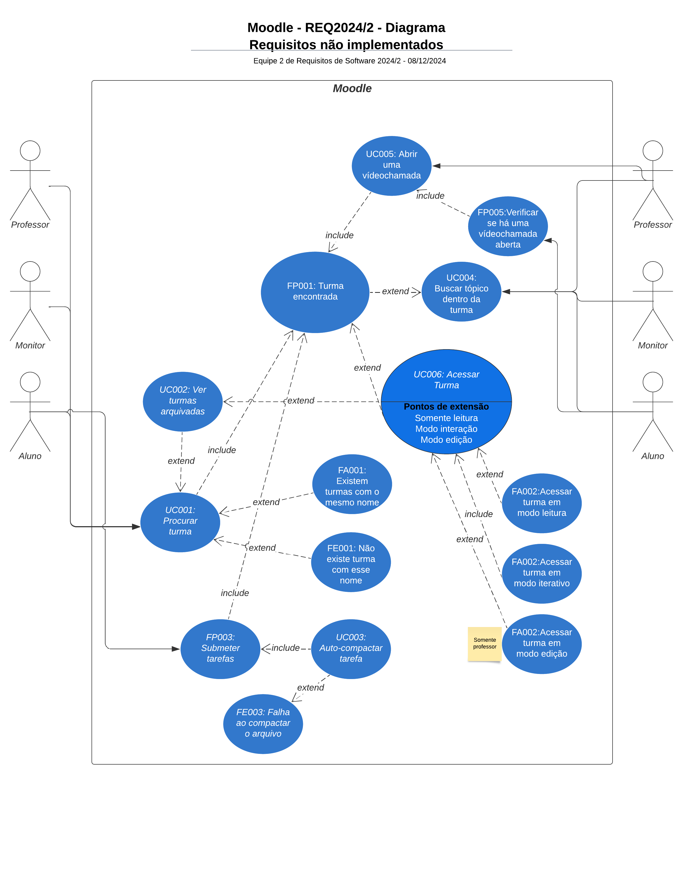

# Caso de Uso

## Introdução

Casos de uso são uma descrição de requisitos funcionais, expressa por meio de um diagrama UML. Normalmente, são usados para "descrever um conjunto de ações que um sistema ou um conjunto de sistemas deve desempenhar em colaboração com um ou mais usuários externos ao sistema" [(SERRANO, 2017)](https://aprender3.unb.br/pluginfile.php/2972480/mod_resource/content/1/Requisitos%20-%20Aula%20013a.pdf).

Um dos pontos mais importantes de um caso de uso é prover um resultado observável [(SERRANO, 2017)](https://aprender3.unb.br/pluginfile.php/2972480/mod_resource/content/1/Requisitos%20-%20Aula%20013a.pdf), um objetivo que é atingível com requisitos implementados de maneira concreta e sendo observáveis dentro do sistema. 

Casos de uso incluem fluxo primário, fluxos alternativos e de exceção. Os fluxos descrevem conjuntos de ações que o usuário tomaria e que ocorrem no sistema. Casos de uso incluem atores primários e secundários, localizados à esquerda e à direita do sistema, respectivamente, e o detalhamento dos casos de uso em si. Setas *extend* e *include* representam uma continuação opcional ou obrigatória do caso de uso, respectivamente.

## Metodologia

Como nos [cenários](./cenarios.md) e [léxicos](./lexico.md) desenvolvidos, os requisitos que guiaram a implementação do diagrama de caso de uso foram os [requisitos não implementados](./areq_nao_imp.md#rni) no Moodle. Essa decisão foi tomada com base em utilizar o projeto como sugestão de melhora para a plataforma Moodle, enquanto executamos o estudo e aplicação de técnicas de Requisitos de Software.

Cada membro ficou responsável por trazer casos de uso relevantes aos [requisitos escolhidos](./areq_nao_imp.md#divisao). Os casos de uso estão representados como **'UCX'**, com **'X'** sendo número cronológico de implementação. Os requisitos transformados convertidos em casos de uso podem ser verificados na tabela 1, a seguir: 

| Requisito        |  Responsável                 | Caso de Uso                  |  
|------------------|------------------------------|------------------------------|
| RE31             | Júlia Lopes, Rodrigo Orlandi | UC001                        |
| RE09             | Laís Cecília                 | UC002                        |                  
| RE25             | João Paulo                   | UC003                        |
| RE21             | João Paulo                   | UC004                        |
| RE28             | Esther Sousa                 | UC005                        |
| RE12             | Laís Cecília                 | UC006                        |
/// caption | <
Tabela 1 — Divisão de requisitos não implementados, seus responsáveis e os casos de uso em que foram convertidos.
///
/// caption
Fonte: Rodrigo de Andrade (Autor)
///

### Especificação do Diagrama de Caso de Uso

A estrutura do diagrama de caso de uso é dividida em Nome, Descrição, Atores, Pré-Condição, Pós-Condição, Fluxo Principal, Fluxo Alternativo e Fluxo de Exceção. 

* **Nome** se refere ao título do diagrama de uso, identificando-o; 

* **Descrição** se refere à [especificação de casos de uso](#especificacao-dos-casos-de-uso) presentes após o diagrama de caso de uso, descrevendo os casos, pré e pós-condições, fluxos principais, alternativos e de exceção;    

* **Atores** são divididos entre atores primários e secundários. Atores primários têm interesse em acessar o sistema para receber um serviço diretamente. Os atores secundários, também conhecidos como atores de suporte, interagem com o sistema para fornecer algum tipo de serviço ou informação. Os atores primários estão sempre presentes à esquerda do sistema, e os secundários à direita. No Moodle, os usuários 'Aluno', 'Professor' e 'Monitor' são atores primários e secundários;

* **Pré-Condição** se refere ao fluxo ou caso de uso anterior que possibilita o caso de uso ou fluxo atual sendo analisado;

* **Pós-Condição** se refere ao fluxo ou caso de uso posterior, que ocorre após o caso de uso ou fluxo atual sendo analisado. Normalmente segue o fluxo principal;

* **Fluxos** são divididos em fluxos primários, alternativos e de exceção. Fluxos primários determinam o caminho ideal a ser seguido sobre casos de uso. Fluxos alternativos demonstram possibilidades de navegação do sistema, dependendo das necessidades e intenções do usuário. Fluxos de exceção determinam casos em que ocorrem erros, preparando o sistema para agir de acordo.

## Diagrama de Caso de Uso

A figura 1, a seguir, apresenta o diagrama de casos de uso, originalmente convertido dos trabalhos individuais dos membro. As tabelas 2-7, a seguir, explicam individualmente os casos de uso e seus detalhes em específico.

/// caption | <
Figura 1 — Diagrama de casos de uso do Moodle com enfoque nos requisitos não implementados.
///
/// caption
Fonte: Rodrigo Orlandi (Autor)
///

## Especificação dos casos de uso

=== "Procurar turma"

    |UC001| Procurar turma|
    |---:|-----------|
    |**Atores**| Qualquer usuário|
    |**Frequência de uso**| Alta|
    |**Requisitos**| A turma procurada tem de estar no sistema |
    |**Condição de entrada**| Usuário está ou não está cadastrado em uma turma |
    |**Fluxo Principal**| Usuário encontra a barra de "pesquisar turmas" na página principal |
    |**Fluxos Alternativo**| Usuário encontra turmas com mesmo nome (FA001) |
    |**Fluxos de Exceção**| A turma não existe (FE001)|
    |**Pós Condição**| O usuário haverá encontrado a turma (FP001)|
    |**Rastreabilidade**| [RE31](./areq_nao_imp.md#rni)|
    /// caption | <
    #### Tabela 2 — Primeiro caso de uso, que representa a procura de turmas. { #__tabbed_1_1 data-toc-label="Procurar turma" }
    ///
    /// caption
    Fonte: Júlia Lopes, Rodrigo Orlandi (Autores)
    ///

=== "Ver turmas arquivadas"

    |UC002| Ver turmas arquivadas|
    |---:|-----------|
    |**Atores**| Qualquer usuário|
    |**Frequência de uso**| Baixa|
    |**Requisitos**| Já ter sido cadastrado na turma arquivada |
    |**Condição de entrada**| Usuário clica em um dos seus cursos arquivados|
    |**Fluxo Principal**| O sistema apresenta o curso no modo leitura |
    |**Fluxos Alternativo**| Não há |
    |**Fluxos de Exceção**| Não há |
    |**Pós Condição**| O usuário estará na página do curso, em modo leitura|
    |**Rastreabilidade**| [RE09](./areq_nao_imp.md#rni) |
    /// caption | <
    #### Tabela 3 — Segundo caso de uso, que representa a visualização de turmas arquivadas. { #__tabbed_1_2 data-toc-label="Ver turmas arquivadas" }
    ///
    /// caption
    Fonte: Laís Cecília (Autora)
    ///

=== "Auto-compactação de tarefas"

    |UC003| Auto-compactação de tarefas |
    |---:|-----------|
    |**Atores**| Aluno |
    |**Frequência de uso**| Média |
    |**Requisitos**| Já ter sido cadastrado na turma em que deseja enviar tarefa, ter baixado e realizado a tarefa |
    |**Condição de entrada**| Usuário clica em submeter tarefas (FP003)|
    |**Fluxo Principal**| Usuário, no processo de submeter tarefas (FP003), compacta o arquivo com sucesso (UC003)|
    |**Fluxos Alternativo**| Não há |
    |**Fluxos de Exceção**| Ocorre uma falha na compactação de arquivs (FE003) |
    |**Pós Condição**| O usuário consegue comprimir o arquivo e enviá-lo ao sistema|
    |**Rastreabilidade**| [RE25](./areq_nao_imp.md#rni) |
    /// caption | <
    #### Tabela 4 — Terceiro caso de uso, que representa a auto-compactação de tarefas no momento de seu envio. { #__tabbed_1_3 data-toc-label="Auto-compactação de tarefas" }
    ///
    /// caption
    Fonte: João Paulo (Autor)
    ///

=== "Buscar tópico dentro da turma"

    |UC004| Buscar tópico dentro da turma|
    |---:|-----------|
    |**Atores**| Qualquer usuário|
    |**Frequência de uso**| Alta|
    |**Requisitos**| Estar matriculado no curso |
    |**Condição de entrada**| Usuário clica em um dos seus cursos|
    |**Fluxo Principal**| O sistema apresenta o curso no modo interativo |
    |**Fluxos Alternativo**| 1. Se o usuário for um professor, o curso pode ser aberto no modo edição   2. Se o usuário for um monitor, o curso é aberto no modo leitura |
    |**Fluxos de Exceção**| Não há |
    |**Pós Condição**| O usuário estará na página do curso|
    |**Rastreabilidade**| [RE02](./areq_nao_imp.md#rni) |
    /// caption | <
    #### Tabela 5 — Quarto caso de uso, que representa a funcionalidade de buscar tópicos dentro da turma. { #__tabbed_1_4 data-toc-label="Buscar tópico dentro da turma" }
    ///
    /// caption
    Fonte: João Paulo(Autor)
    ///

=== "Abrir uma vídeochamada"

    |UC005| Abrir uma vídeochamada |
    |---:|-----------|
    |**Atores**| Professor |
    |**Frequência de uso**| - |
    |**Requisitos**| Usuário 'Professor' estar cadastrado  como 'Professor' na turma na qual a vídeochamada for aberta |
    |**Condição de entrada**| Usuário 'Professor' escolhe a turma na qual deseja abrir a vídeochamada |
    |**Fluxo Principal**| O usuário 'Aluno' verifica se há uma vídeochamada aberta na turma (FP005) |
    |**Fluxos Alternativo**| Não há |
    |**Fluxos de Exceção**| Não há |
    |**Pós Condição**| O usuário estará na tela "Meus Cursos"|
    |**Rastreabilidade**| [RE28](./areq_nao_imp.md#rni) |
    /// caption | <
    #### Tabela 6 — Quinto caso de uso, que representa a possibilidade de abrir vídeochamadas em uma turma. { #__tabbed_1_5 data-toc-label="Abrir uma vídeochamada" }
    ///
    /// caption
    Fonte: Esther Sousa (Autora)
    ///

=== "Acessar turmas"

    |UC006| Acessar turmas|
    |---:|-----------|
    |**Atores**| Qualquer usuário|
    |**Frequência de uso**| Alta|
    |**Requisitos**| Não há|
    |**Condição de entrada**| Usuário clica na opção "Meus Cursos"|
    |**Fluxo Principal**| O sistema apresenta os cursos em que o usuário está matriculado e o botão de ver cursos arquivados |
    |**Fluxos Alternativo**| Ao clicar no botão de ver cursos arquivados, o sistema exibe os mesmos |
    |**Fluxos de Exceção**| Não há |
    |**Pós Condição**| O usuário estará na tela "Meus Cursos"|
    |**Rastreabilidade**| [RE12](./areq_nao_imp.md#rni) |
    /// caption | <
    #### Tabela 7 — Segundo caso de uso, que representa a visualização de turmas arquivadas. { #__tabbed_1_6 data-toc-label="Acessar turmas" }
    ///
    /// caption
    Fonte: Laís Cecília (Autora)
    ///

---

## Referências

| # | Fonte|
|---|:------|
| 1 | SERRANO, Milene. SERRANO, Maurício. Requisitos - Aula 13. UnB Gama (FCTE). Disponível em: [https://aprender3.unb.br/pluginfile.php/2972480/mod_resource/content/1/Requisitos%20-%20Aula%20013a.pdf](https://aprender3.unb.br/pluginfile.php/2972480/mod_resource/content/1/Requisitos%20-%20Aula%20013a.pdf). Acesso em: 08/12/2024. |

## Histórico
| Versão | Descrição                  | Autor                           | Revisor                  |                 Revisado          | Data       |
|--------|----------------------------|---------------------------------|--------------------------|-----------------------------------|------------|
| v1.0   | Feito upload da página | Rodrigo de Andrade| Laís Cecília | <input type="checkbox" onclick="return false;" disabled checked/> | 08/12/2024 |
| v1.1   | Formatação | Laís Cecília| Rodrigo de Andrade | <input type="checkbox" onclick="return false;" disabled checked/> | 08/12/2024 |
| v1.2   | Correções pós reunião      | Rodrigo Orlandi |  Esther Sousa                        | <input type="checkbox" onclick="return false;" disabled checked /> | 08/12/2024 |
| v1.3   | Mudanças tabs              | Laís Cecília    | João Paulo                           | <input type="checkbox" onclick="return false;" disabled checked/>  | 11/12/2024