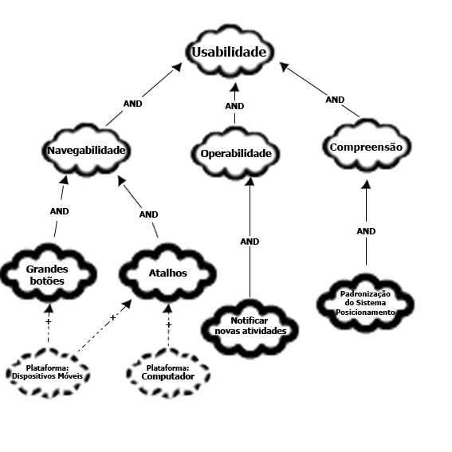
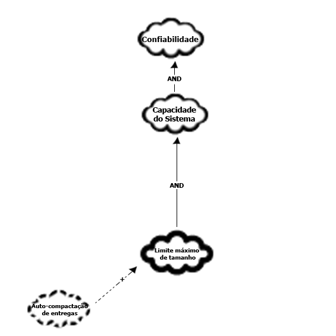
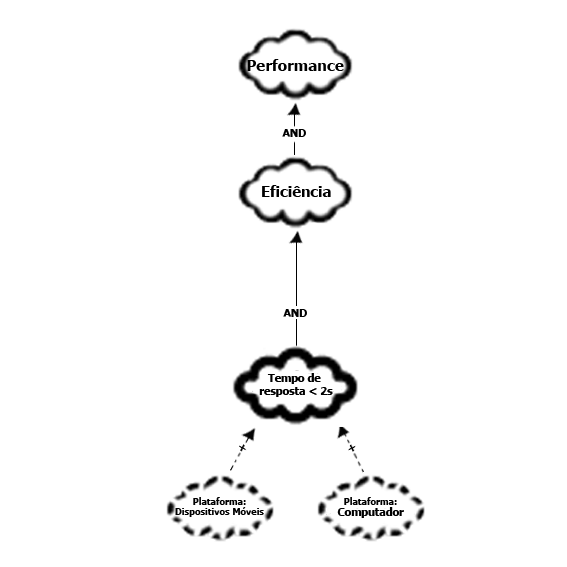
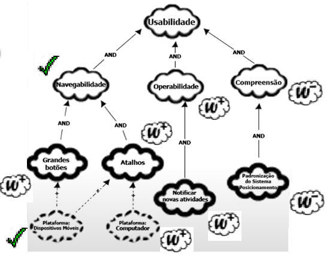
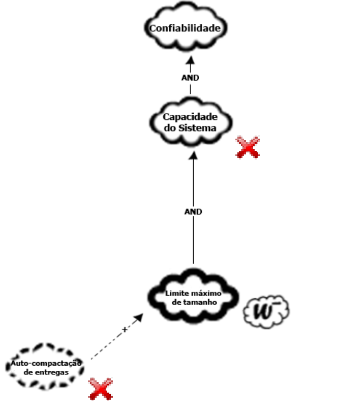
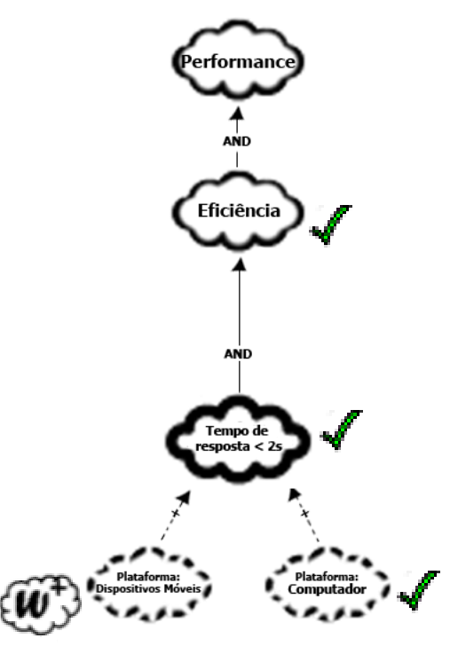

# Framework NFR

## Introdução

De acordo com [(Serrano et. al, 2017)](https://aprender3.unb.br/pluginfile.php/2972516/mod_resource/content/1/Requisitos%20-%20Aula%20019a.pdf), "trata-se de um framework conceitual para condução da Engenharia de Requisitos orientada
aos requisitos não funcionais, com uma extensão que apoia suposições para avaliação de
satisfação das metas-flexíveis".

## Metodologia

Para o desenvolvimento de frameworks NFR, são necessários os requisitos não funcionais como base. 
* Com os requisitos não funcionais elicitados, analisa-se em sob qual tópico do FURPS+ os requisitos são agrupados; 
* A partir da análise, são realizadas frameworks de cada tópico, com estabelecimento de softgoals e associações de diversos tipos.
* Por fim, a framework é, juntamente com um usuário ou *Product Owner*, julgada por *labels* que determinam o grau no qual os softgoals foram implementados ou podem ser cumpridos.  

Os requisitos não funcionais foram elicitados pela equipe em [entregas anteriores](https://requisitos-de-software.github.io/2024.2-Moodle/Entregas/02%20-%20Elicita%C3%A7%C3%A3o/arequisitos_elicitados/), com a necessidade adicional de tornar os requisitos mensuráveis para que possam ser propriamente analisados. 

A tabela 1, a seguir, apresenta uma versão revisada dos requisitos não funcionais elicitados pelo projeto, a fim de torná-los mensuráveis e ajustá-los dentro do formato de requisitos não funcionais quando necessário.

| Código  | Tipo de Requisito          | Descrição do Requisito  |  Foi implementado?  | Origem |
|---------|----------------------------|-------------------------|---------------------|--------|
| RE06    |  Requisito não Funcional   |  A notificação de entregas futuras por meio do Calendário e Painel/Dashboard deve ser acessível por no máximo, um clique após fazer o login no sistema. | SIM | ENT17, ANA04, ANA11, ANA18 |
| RE20    |  Requisito Não Funcional   |  A navegação do aplicativo mobile deve ter símbolos grandes e posicionados de maneira a tornar a navegação mais efetiva com um número menor de cliques, com uma média de 4 para o usuário chegar onde deseja. | NÃO | ANA15, ENT06 |
| RE22    |  Requisito Não Funcional   |  O sistema deve ter um tempo de resposta menor ou igual a dois segundos para cada clique. | NÃO | ENT09 |
| RE24    |  Requisito Não Funcional   |  Os arquivos enviados ao sistema devem possuir um limite máximo de tamanho. | SIM |ENT12 |
| RE25    |  Requisito Não Funcional   |  A auto-compactação de arquivos deve ser mostrada ao usuário se os arquivos que deseja enviar excederem a capacidade máxima. | NÃO | ENT13 |
| RE31    |  Requisito não Funcional   | A barra de busca de turmas é localizável assim que o login é realizado, em tela cheia nos computadores e em orientação vertical e/ou horizontal em dispositivos móveis. | NÃO | ENC03 |
/// caption | <
Tabela 1 — Tabela com todos os requisitos não funcionais elicitados no projeto.
///
/// caption
Fonte: Autores
///

A tabela 2, a seguir, denomina os tipos de softgoals abordados e alguns dos operadores utilizados para a relação entre eles. É de nota que foram incluídos apenas os elementos utilizados pela equipe; existem mais operadores que podem ser utilizados em uma framework NFR.

| Imagem | Nome & Descrição| 
|:-----------------------:|:-------------------|
|  {width="100" height="100"}  | **Softgoal NFR**: Característica abstrata, a qual se deseja considerar na análise, visando saber se a mesma será cumprida ou não cumprida, ou seja, escolhida ou não escolhida para ser implementada [(Serrano et. al, 2017)](https://aprender3.unb.br/pluginfile.php/2972516/mod_resource/content/1/Requisitos%20-%20Aula%20019a.pdf). |
|  {width="100" height="100"} | **Softgoal de Operacionalização**: Representa soluções de implementação que satisfazem softgoals NFR ou outros softgoals de operacionalização. Pode incluir operações, processos, estruturações e restrições no sistema. Representam as funcionalidades |
|  {width="100" height="100"} | **Softgoal de Afirmação**: permitem que as características do domínio sejam consideradas e refletidas no processo de tomada de decisão. Servem como justificativa para apoiar ou negar a forma como os softgoals são priorizados, refinados e os componentes são selecionados. |
| AND | **Operador AND**: Implica que se os softgoals descendentes forem atendidos, os acendentes também serão. |
| + | **Help (+)**: O softgoal filho com contribuição positiva parcial, que sozinho não chega a satisfazer o softgoal pai sob a perspectiva dos envolvidos [(Serrano et. al, 2017)](https://aprender3.unb.br/pluginfile.php/2972516/mod_resource/content/1/Requisitos%20-%20Aula%20019a.pdf). |
/// caption | <
Tabela 2 — Siginificado dos elementos visuais de diagramas da Framework NFR.
///
/// caption
Fonte:Rodrigo Orlandi (Autor)
///

Por fim, após a realização dos diagramas da framework NFR, é necessária a revisão que determina o grau de cumprimento dos *softgoals* dentro de um software. Para o projeto, o grau de cumprimento analisado refere-se aos requisitos não funcionais implementados no projeto.

A tabela 3 a seguir demonstra os possíveis graus de cumprimento dos softgoals, determinados com base no conteúdo de [(Serrano et. al, 2017)](https://aprender3.unb.br/pluginfile.php/2972516/mod_resource/content/1/Requisitos%20-%20Aula%20019a.pdf).

| Símbolo | Nome & Significado| 
|:-----------------------:|:-------------------|
|  {width="100" height="100"} | **Satisfeito**: Pode ou é cumprido segundo a análise. |
|  {width="100" height="100"} | **Satisfeito (fraco)**: É parcialmente cumprido. |
|  {width="100" height="100"} | **Não decidido**: A realização do softgoal não pode ser. confirmada ou negada. |
|  {width="100" height="100"} | **Recusado (fraco)**: Há indicadores que vão contra o softgoal. |
|  {width="100" height="100"} | **Recusado**: O softgoal não é cumprido, segundo a análise. |
|  {width="100" height="100"} | **Conflito**: Existem indicadores positivos e negativos para o cumprimento do softgoal. |
/// caption | <
Tabela 3 — Símbolos e significados respectivos dos graus de cumprimento de softgoals.
///
/// caption
Fonte: [(Serrano et. al, 2017)](https://aprender3.unb.br/pluginfile.php/2972516/mod_resource/content/1/Requisitos%20-%20Aula%20019a.pdf) (Adaptado).
///

## Frameworks NFRs e Revisão 

Foram desenvolvidas três frameworks NFR com base nos requisitos não funcionais elicitados pelo projeto, referente aos tópicos Usabilidade, Confiabilidade e Performance, originados do FURPS+. A tabela 4, a seguir, explica cada um dos tópicos em mais detalhes.

A escolha de três tópicos é explicada pela alocação dos requisitos não funcionais elicitados no projeto de acordo com o tópico que os melhor descrevem. A tabela 5, a seguir, demonstra a relação entre tópicos da FURPS+ e os requisitos não funcionais.

| Título do Tópico | Descrição| 
|:-----------------------:|:-------------------|
|  **Usabilidade**   | Refere-se à "eficiência, eficácia e satisfação com a qual os públicos do produto alcançam objetivos em um determinado ambiente", de acordo com a [ISO 9241-11:2018](https://www.iso.org/standard/63500.html).  |
|  **Perfomance**    | Refere-se à capacidade do sistema de executar programas dentro de padrões como dentro de certos períodos de tempo, a eficácia de como consegue aproveitar o tempo para um certo número de execuções, entre outros. |
|  **Confiabilidade**| Refere-se à capacidade do sistema de funcionar corretamente, de forma que evite ao máximo erros e brechas de dados dentro de sua execução.|
/// caption | <
Tabela 4 — Tópicos de FURPS+ abordados pelos requisitos não funcionais do projeto.
///
/// caption
Fonte:Rodrigo Orlandi (Autor)
///

| Tópico FURPS+ | RNFs alocados| 
|:-----------------------:|:-------------------|
|  **Usabilidade**   | RE06, RE20, RE31  |
|  **Perfomance**    | RE22              |
|  **Confiabilidade**| RE24, RE25        |
/// caption | <
Tabela 5 — Relação de tópicos do FURPS+ com RNFs elicitados anteriormente no projeto.
///
/// caption
Fonte:Rodrigo Orlandi (Autor)
///

### Frameworks NFR desenvolvidas

As figuras 1 a 3 a seguir apresentam as Frameworks NFRs desenvolvidas pelo grupo.

/// caption | <
Figura 1 — Framework NFR de Usabilidade, acerca dos requisitos não funcionais elicitados.
///
/// caption
Fonte: Rodrigo Orlandi (Autor)
///

/// caption | <
Figura 2 — Framework NFR de Confiabilidade, acerca dos requisitos não funcionais elicitados.
///
/// caption
Fonte: Rodrigo Orlandi (Autor)
///

/// caption | <
Figura 3 — Framework NFR de Performance, acerca dos requisitos não funcionais elicitados.
///
/// caption
Fonte: Rodrigo Orlandi (Autor)
///

### Revisão 

Após a realização das três NFRs, é necessário analisar todas de forma a verificar quais softgoals podem ser ou foram cumpridos pelo software. Para a análise, é necessário a presença de um cliente do software ou de um *Product Owner*, se estiver sendo trabalhada a metodologia Scrum.

A gravação a seguir apresenta a revisão feita com um usuário do aplicativo Moodle.

<iframe width="500" height="285" src="https://www.youtube.com/embed/hyQK7UKK2p4" title="[2024-2] Requisitos - Grupo 2 - Gravação de NFRs" frameborder="0" allow="accelerometer; autoplay; clipboard-write; encrypted-media; gyroscope; picture-in-picture; web-share" referrerpolicy="strict-origin-when-cross-origin" allowfullscreen></iframe>

As figuras 4 a 6, a seguir, apresenta a versão revisada dos NFRs após discussão com o cliente, demonstrando o grau no qual os softgoals foram cumpridos.

/// caption | <
Figura 4 — Framework NFR de Usabilidade revisado, levando em consideração RNFs implementados e opinião do cliente.
///
/// caption
Fonte: Rodrigo Orlandi (Autor)
///

/// caption | <
Figura 5 — Framework NFR de Confiabilidade revisado, levando em consideração RNFs implementados e opinião do cliente.
///
/// caption
Fonte: Rodrigo Orlandi (Autor)
///

/// caption | <
Figura 6 — Framework NFR de Performance revisado, levando em consideração RNFs implementados e opinião do cliente.
///
/// caption
Fonte: Rodrigo Orlandi (Autor)
///

## Referências

| # | Fonte|
|---|:------|
| 1 | SERRANO, Milene. SERRANO, Maurício. Requisitos - Aula 17. UnB Gama (FCTE). Disponível em: [https://aprender3.unb.br/pluginfile.php/2972516/mod_resource/content/1/Requisitos%20-%20Aula%20019a.pdf](https://aprender3.unb.br/pluginfile.php/2972516/mod_resource/content/1/Requisitos%20-%20Aula%20019a.pdf). Acesso em: 17/12/2024. |
| 2 | ISO 9241-11:2018. Disponível em: [https://www.iso.org/standard/63500.html](https://www.iso.org/standard/63500.html). Acesso em: 17/12/2024.|

## Histórico

| Versão | Descrição                  | Autor                           | Revisor                  |                 Revisado          | Data       |
|--------|----------------------------|---------------------------------|--------------------------|-----------------------------------|------------|
| v1.0   | Página Criada              | Rodrigo Orlandi  |  Laís Cecília                       | <input type="checkbox" onclick="return false;" disabled checked/> | 17/12/2024 |