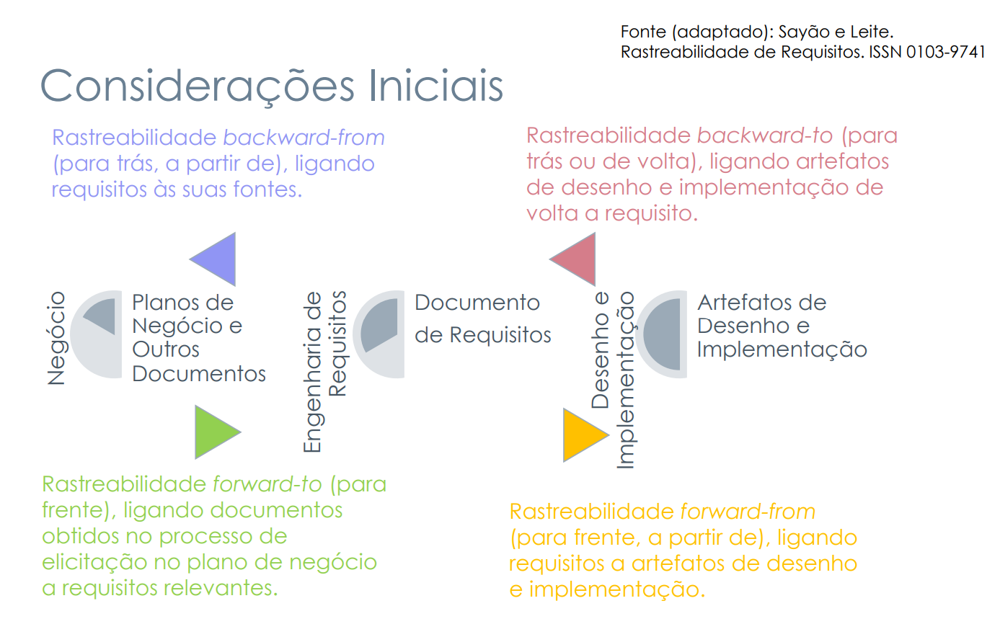

# Forward-To e Forward-From

## Introdução

Rastreabilidade de requisitos refere-se à ciência sobre a origem e destino de um artefato, podendo traçar um caminho claro que inclua todos os artefatos referentes ao original. Ela é de grande importância para um projeto ao ajudar correção de defeitos, validação, resolução de requisitos em conflito, e reutilização de componentes e artefatos, entre outros [(SERRANO, SERRANO, 2017)](https://aprender3.unb.br/pluginfile.php/2972560/mod_resource/content/1/Requisitos%20-%20Aula%20026.pdf).  

A rastreabilidade Forward-To é um tipo de rastreabilidade que liga
"documentos obtidos no processo de elicitação no plano de negócio a requisitos relevantes"
([(SERRANO, SERRANO, 2017)](https://aprender3.unb.br/pluginfile.php/2972560/mod_resource/content/1/Requisitos%20-%20Aula%20026.pdf)), sendo classificado como rastreabilidade de pré-ordem.

A Rastreabilidade Forward-To é um tipo de rastreabilidade de pré-ordem que liga
"documentos obtidos no processo de elicitação no plano de negócio a requisitos relevantes"
([(SERRANO, SERRANO, 2017)](https://aprender3.unb.br/pluginfile.php/2972560/mod_resource/content/1/Requisitos%20-%20Aula%20026.pdf)), sendo classificada como rastreabilidade de pós-ordem.

Ambas as rastreabilidades podem ser verificadas na figura 1, a seguir, que ilustra os tipos de rastreabilidade de um projeto de software.

/// caption | <
Figura 1 — Tipos de rastreabilidade.
///
/// caption
Fonte: [Serrano, Serrano - Página 19, 2017](https://aprender3.unb.br/pluginfile.php/2972560/mod_resource/content/1/Requisitos%20-%20Aula%20026.pdf) (Adaptado)
///

## Metodologia

Para devidamente ilustrar as relações de rastreabilidade ao longo deste projeto, foram pegos os requisitos elicitados como base e foram ilustradas as conexões de rastreabilidade **Forward-To** e **Forward-From**, a fim de prover uma base sólida de pré e pós-rastreabilidade que permita a navegabilidade e a gerência entre os requisitos do projeto, os artefatos utilizados como base para seu desenvolvimento e os artefatos desenvolvidos a partir dos requisitos. 

Além de prover a navegabilidade, os elos foram classificados a partir dos meta-modelos de Toranzo, possibilitando um entendimento mais profundo dos tipos de elo presentes no projeto. A tabela 1 a seguir detalha os níveis disponíveis no meta-modelo que indicam o conteúdo tratado pelos elos.

|  Nível     | Descrição             |
| ---------- | --------------------- |
|  Ambiental | Informações oriundas do contexto no qual a organização está inserida. |
|  Organizacional | Informações pertencentes à organização (missão, objetivos e estratégias). |
|  Gerencial | Informações que auxiliam a gerência do projeto. |
|  Desenvolvimento |  Dados ao longo do processo de desenvolvimento (artefatos de requisitos, diagramas, códigos, casos de teste e outros). |
/// caption | <
Tabela 1 — Níveis de elos de acordo com o meta-modelo de Toranzo.
///
/// caption
Fonte: [Serrano, Serrano - Página 19, 2017](https://aprender3.unb.br/pluginfile.php/2972560/mod_resource/content/1/Requisitos%20-%20Aula%20026.pdf) (Adaptado)
///

A segunda classificação refere-se aos tipos de elos de Toranzo. A tabela 2, a seguir, detalha como os elos em si podem ser classificados de acordo com o tipo de relação que cumprem.

|  Tipo    | Descrição             |
| ---------- | --------------------- |
|  Satisfação | Classe origem tem dependência de satisfação com a classe destino. |
|  Recurso | Classe origem tem dependência de recurso com a classe destino. |
|  Responsabilidade | Registra a participação, responsabilidade e ação de pessoas sobre artefatos. |
|  Representação |  Captura a representação ou modelagem dos requisitos em outras linguagens. |
|  Alocado |  Classe origem está relacionada à classe destino, que representa um subsistema. |
|  Agregação |  Indica “composição” de elementos.|
/// caption | <
Tabela 2 — Tipos de elos de acordo com o meta-modelo de Toranzo.
///
/// caption
Fonte: [Serrano, Serrano - Página 21, 2017](https://aprender3.unb.br/pluginfile.php/2972560/mod_resource/content/1/Requisitos%20-%20Aula%20026.pdf) (Adaptado)
///

## Tabela Forward-To

Na tabela 3, a seguir, as relações Forward-To do projeto estão detalhadas e classificadas de acordo com o nível e tipos de elos de rastreabilidade de acordo com o meta-modelo de Toranzo. A origem dos requisitos está codificado da seguinte maneira, de acordo com seus respectivos artefatos: 

* [Análise de interface](https://requisitos-de-software.github.io/2024.2-Moodle/Entregas/02%20-%20Elicita%C3%A7%C3%A3o/Elicita%C3%A7%C3%A3o/analise_interface/)(ANAXX), 
* [Entrevista](https://requisitos-de-software.github.io/2024.2-Moodle/Entregas/02%20-%20Elicita%C3%A7%C3%A3o/Elicita%C3%A7%C3%A3o/entrevista/)(ENTXX), 
* [Encenação](https://requisitos-de-software.github.io/2024.2-Moodle/Entregas/02%20-%20Elicita%C3%A7%C3%A3o/Elicita%C3%A7%C3%A3o/encenacao/)(ENCXX).

| ID| REQUISITO | DESCRIÇÃO | ORIGINADO EM: | CATEGORIA (Toranzo) |
| -------- | ------- | ------- | ------- | ------------|
| 01 | RE01 - RF01   |  Sistema requer login do usuário para ser acessado. | [ANA01, ANA08, ANA16](https://requisitos-de-software.github.io/2024.2-Moodle/Entregas/02%20-%20Elicita%C3%A7%C3%A3o/Elicita%C3%A7%C3%A3o/analise_interface/#requisitos-elicitados), [ENC01](https://requisitos-de-software.github.io/2024.2-Moodle/Entregas/02%20-%20Elicita%C3%A7%C3%A3o/Elicita%C3%A7%C3%A3o/encenacao/#requisitos-elicitados), [ENT01](https://requisitos-de-software.github.io/2024.2-Moodle/Entregas/02%20-%20Elicita%C3%A7%C3%A3o/Elicita%C3%A7%C3%A3o/entrevista/#requisitos-elicitados) | Gerencial - Satisfação |
| 02 | RE02 - RF02   |  O sistema deve permitir que o aluno possa vizualizar o material disponibilizado pelo professor. | [ANA02](https://requisitos-de-software.github.io/2024.2-Moodle/Entregas/02%20-%20Elicita%C3%A7%C3%A3o/Elicita%C3%A7%C3%A3o/analise_interface/#requisitos-elicitados), [ANA21](https://requisitos-de-software.github.io/2024.2-Moodle/Entregas/02%20-%20Elicita%C3%A7%C3%A3o/Elicita%C3%A7%C3%A3o/analise_interface/#requisitos-elicitados), [ENC02](https://requisitos-de-software.github.io/2024.2-Moodle/Entregas/02%20-%20Elicita%C3%A7%C3%A3o/Elicita%C3%A7%C3%A3o/encenacao/#requisitos-elicitados), [ENT02](https://requisitos-de-software.github.io/2024.2-Moodle/Entregas/02%20-%20Elicita%C3%A7%C3%A3o/Elicita%C3%A7%C3%A3o/entrevista/#requisitos-elicitados) |  Desenvolvivmento - Satisfação |
| 03 | RE03 - RF03    |  O sistema deve permitir que o aluno possa baixar arquivos. | [ANA03](https://requisitos-de-software.github.io/2024.2-Moodle/Entregas/02%20-%20Elicita%C3%A7%C3%A3o/Elicita%C3%A7%C3%A3o/analise_interface/#requisitos-elicitados), [ANA10](https://requisitos-de-software.github.io/2024.2-Moodle/Entregas/02%20-%20Elicita%C3%A7%C3%A3o/Elicita%C3%A7%C3%A3o/analise_interface/#requisitos-elicitados), [ANA22](https://requisitos-de-software.github.io/2024.2-Moodle/Entregas/02%20-%20Elicita%C3%A7%C3%A3o/Elicita%C3%A7%C3%A3o/analise_interface/#requisitos-elicitados), [ENT03](https://requisitos-de-software.github.io/2024.2-Moodle/Entregas/02%20-%20Elicita%C3%A7%C3%A3o/Elicita%C3%A7%C3%A3o/entrevista/#requisitos-elicitados) |  Desenvolvimento - Satisfação |
| 04 | RE04 - RF04    |  O sistema deve permitir que alunos possam filtrar as suas matérias cursadas. | [ENT21](https://requisitos-de-software.github.io/2024.2-Moodle/Entregas/02%20-%20Elicita%C3%A7%C3%A3o/Elicita%C3%A7%C3%A3o/entrevista/#requisitos-elicitados ) |  Desenvolvimento - Satisfação |
| 05 | RE05 - RF05    |  O sistema deve possuir usuários do tipo 'Aluno', 'Professor' e 'Monitor'. | [ENT16](https://requisitos-de-software.github.io/2024.2-Moodle/Entregas/02%20-%20Elicita%C3%A7%C3%A3o/Elicita%C3%A7%C3%A3o/entrevista/#requisitos-elicitados ) |  Organizacional/Gerencial - Representação |
| 06 | RE06 - RNF01    |   O sistema deve notificar o aluno de entregas se aproximando da deadline por meio do Calendário ou Painel/Dashboard. | [ENT17](https://requisitos-de-software.github.io/2024.2-Moodle/Entregas/02%20-%20Elicita%C3%A7%C3%A3o/Elicita%C3%A7%C3%A3o/entrevista/#requisitos-elicitados), [ANA04](https://requisitos-de-software.github.io/2024.2-Moodle/Entregas/02%20-%20Elicita%C3%A7%C3%A3o/Elicita%C3%A7%C3%A3o/analise_interface/#requisitos-elicitados), [ANA11](https://requisitos-de-software.github.io/2024.2-Moodle/Entregas/02%20-%20Elicita%C3%A7%C3%A3o/Elicita%C3%A7%C3%A3o/analise_interface/#requisitos-elicitados), [ANA18](https://requisitos-de-software.github.io/2024.2-Moodle/Entregas/02%20-%20Elicita%C3%A7%C3%A3o/Elicita%C3%A7%C3%A3o/analise_interface/#requisitos-elicitados) | Desenvolvimento - Satisfação |
| 07 | RE07 - RF06    |  O sistema deve permitir que os usuários 'Professor’ e 'Monitor’ possam corrigir atividades enviadas pelo usuário ‘Aluno'. | [ENT18](https://requisitos-de-software.github.io/2024.2-Moodle/Entregas/02%20-%20Elicita%C3%A7%C3%A3o/Elicita%C3%A7%C3%A3o/entrevista/#requisitos-elicitados)| Desenvolvimento - Satisfação |
| 08 | RE08 - RF07    |  O sistema deve avisar o aluno quando ele tiver alguma atividade próxima.| [ENT08](https://requisitos-de-software.github.io/2024.2-Moodle/Entregas/02%20-%20Elicita%C3%A7%C3%A3o/Elicita%C3%A7%C3%A3o/entrevista/#requisitos-elicitados) | Ambiental - Satisfação |
| 09 | RE09 - RF08    |  O sistema permite que alunos visualizem as turmas em que já foram cadastrados (arquivadas) | [ANA13](https://requisitos-de-software.github.io/2024.2-Moodle/Entregas/02%20-%20Elicita%C3%A7%C3%A3o/Elicita%C3%A7%C3%A3o/analise_interface/#requisitos-elicitados), [ANA19](https://requisitos-de-software.github.io/2024.2-Moodle/Entregas/02%20-%20Elicita%C3%A7%C3%A3o/Elicita%C3%A7%C3%A3o/analise_interface/#requisitos-elicitados) | Organizacional - Alocado |
| 10 | RE10 - RF09    |  O sistema disponibiliza as notas do aluno. | [ANA24](https://requisitos-de-software.github.io/2024.2-Moodle/Entregas/02%20-%20Elicita%C3%A7%C3%A3o/Elicita%C3%A7%C3%A3o/analise_interface/#requisitos-elicitados)| Organizacional - Satisfação |
| 11 | RE11 - RF10   |  O aluno deve poder consultar as notas das atividades já corrigidas. | [ENT19](https://requisitos-de-software.github.io/2024.2-Moodle/Entregas/02%20-%20Elicita%C3%A7%C3%A3o/Elicita%C3%A7%C3%A3o/entrevista/#requisitos-elicitados) | Desenvolvimento - Satisfação |
| 12 | RE12 - RF11   |  O sistema permite que alunos visualizem as turmas em que estão cadastrados| [ANA05](https://requisitos-de-software.github.io/2024.2-Moodle/Entregas/02%20-%20Elicita%C3%A7%C3%A3o/Elicita%C3%A7%C3%A3o/analise_interface/#requisitos-elicitados), [ANA12](https://requisitos-de-software.github.io/2024.2-Moodle/Entregas/02%20-%20Elicita%C3%A7%C3%A3o/Elicita%C3%A7%C3%A3o/analise_interface/#requisitos-elicitados), [ANA20](https://requisitos-de-software.github.io/2024.2-Moodle/Entregas/02%20-%20Elicita%C3%A7%C3%A3o/Elicita%C3%A7%C3%A3o/analise_interface/#requisitos-elicitados) | Desenvolvimento - Satisfação |
| 13 | RE13 - RF12    |  O sistema permite que o aluno veja feedback de tarefas | [ENC05](https://requisitos-de-software.github.io/2024.2-Moodle/Entregas/02%20-%20Elicita%C3%A7%C3%A3o/Elicita%C3%A7%C3%A3o/encenacao/#requisitos-elicitados) | Desenvolvimento - Satisfação |
| 14 | RE14 - RF13 |  O conteúdo deve poder ser organizado pelo professor em tópicos e índices de tópicos. | [ENT04](https://requisitos-de-software.github.io/2024.2-Moodle/Entregas/02%20-%20Elicita%C3%A7%C3%A3o/Elicita%C3%A7%C3%A3o/entrevista/#requisitos-elicitados) | Desenvolvimento - Responsabilidade |
| 15 | RE15 - RF14 |  O sistema deve permitir que o professor possa enviar conteúdos, que ficarão disponíveis ao aluno e monitor. | [ENT14](https://requisitos-de-software.github.io/2024.2-Moodle/Entregas/02%20-%20Elicita%C3%A7%C3%A3o/Elicita%C3%A7%C3%A3o/entrevista/#requisitos-elicitados) | Desenvolvimento - Satisfação |
| 16 | RE16 - RF15    |  O professor deve ser capaz de elegir um ou mais monitores para a sua matéria. | [ENT20](https://requisitos-de-software.github.io/2024.2-Moodle/Entregas/02%20-%20Elicita%C3%A7%C3%A3o/Elicita%C3%A7%C3%A3o/entrevista/#requisitos-elicitados) | Desenvolvimento - Satisfação |
| 17 | RE17 - RF16   |  O sistema disponibiliza um fórum para conversa entre alunos e professores | [ANA06, ANA14, ANA26](https://requisitos-de-software.github.io/2024.2-Moodle/Entregas/02%20-%20Elicita%C3%A7%C3%A3o/Elicita%C3%A7%C3%A3o/analise_interface/#requisitos-elicitados) | Organizacional - Satisfação |
| 18 | RE18 - RF17    |  O sistema deve permitir que o monitor possa acompanhar o conteúdo da mesma forma que o aluno para poder ajudá-los no conteúdo. | [ENT10](https://requisitos-de-software.github.io/2024.2-Moodle/Entregas/02%20-%20Elicita%C3%A7%C3%A3o/Elicita%C3%A7%C3%A3o/entrevista/#requisitos-elicitados) | Ambiental - Satisfação |
| 19 | RE19 - RF18   |  O sistema deve possuir uma funcionalidade calendário, permitindo que o usuário 'Aluno' possa vizualizar atividades próximas. | [ENT05](https://requisitos-de-software.github.io/2024.2-Moodle/Entregas/02%20-%20Elicita%C3%A7%C3%A3o/Elicita%C3%A7%C3%A3o/entrevista/#requisitos-elicitados), [ANA04, ANA11, ANA18](https://requisitos-de-software.github.io/2024.2-Moodle/Entregas/02%20-%20Elicita%C3%A7%C3%A3o/Elicita%C3%A7%C3%A3o/analise_interface/#requisitos-elicitados) | Organizacional - Satisfação |
| 20 | RE20 - RNF02   |   A navegação do aplicativo mobile deve ter símbolos grandes e posicionados de maneira a tornar a navegação mais simples, com presença de diversos atalhos. | [ANA15](https://requisitos-de-software.github.io/2024.2-Moodle/Entregas/02%20-%20Elicita%C3%A7%C3%A3o/Elicita%C3%A7%C3%A3o/analise_interface/#requisitos-elicitados), [ENT06](https://requisitos-de-software.github.io/2024.2-Moodle/Entregas/02%20-%20Elicita%C3%A7%C3%A3o/Elicita%C3%A7%C3%A3o/entrevista/#requisitos-elicitados) | Organizacional - Alocado |
| 21 | RE21 - RF19    |  O sistema deve possuir um sistema de busca, dentro das disciplinas, para facilitar e simplificar a navegação dos usuários.| [ENT07](https://requisitos-de-software.github.io/2024.2-Moodle/Entregas/02%20-%20Elicita%C3%A7%C3%A3o/Elicita%C3%A7%C3%A3o/entrevista/#requisitos-elicitados) | Organizacional/Ambiental - Alocado |
| 22 | RE22 - RNF03    |   O sistema deve ter um tempo de resposta menor ou igual a dois segundos para cada clique. | [ENT09](https://requisitos-de-software.github.io/2024.2-Moodle/Entregas/02%20-%20Elicita%C3%A7%C3%A3o/Elicita%C3%A7%C3%A3o/entrevista/#requisitos-elicitados) | Gerencial - Alocado |
| 23 | RE23 - RF20    |  O sistema deve permitir que usuários possam responder formulários. | [ENT11](https://requisitos-de-software.github.io/2024.2-Moodle/Entregas/02%20-%20Elicita%C3%A7%C3%A3o/Elicita%C3%A7%C3%A3o/entrevista/#requisitos-elicitados) | Desenvolvimento - Satisfação |
| 24 | RE24 - RNF04  |   Os arquivos enviados ao sistema devem possuir um limite máximo de tamanho. | [ENT12](https://requisitos-de-software.github.io/2024.2-Moodle/Entregas/02%20-%20Elicita%C3%A7%C3%A3o/Elicita%C3%A7%C3%A3o/entrevista/#requisitos-elicitados) | Gerencial - Satisfação |
| 25 | RE25 - RNF05    |   O sistema deve possuir uma auto-compactação de arquivos se recebê-los exceder o tamanho máximo do arquivo.| [ENT13](https://requisitos-de-software.github.io/2024.2-Moodle/Entregas/02%20-%20Elicita%C3%A7%C3%A3o/Elicita%C3%A7%C3%A3o/entrevista/#requisitos-elicitados) | Gerencial - Alocado |
| 26 | RE26 - RF21    |  O sistema deve automaticamente considerar conteúdos dados, atividades corrigidas, notas de prova e de projetos, resumindo-os em uma porcentagem de conclusão da disciplina.| [ENT15](https://requisitos-de-software.github.io/2024.2-Moodle/Entregas/02%20-%20Elicita%C3%A7%C3%A3o/Elicita%C3%A7%C3%A3o/entrevista/#requisitos-elicitados) | Ambiental - Satisfação |
| 27 | RE27 - RF22    |  O sistema permite que alunos façam upload de tarefas | [ANA07, ANA16, ANA23](https://requisitos-de-software.github.io/2024.2-Moodle/Entregas/02%20-%20Elicita%C3%A7%C3%A3o/Elicita%C3%A7%C3%A3o/analise_interface/#requisitos-elicitados), [ENC04](https://requisitos-de-software.github.io/2024.2-Moodle/Entregas/02%20-%20Elicita%C3%A7%C3%A3o/Elicita%C3%A7%C3%A3o/encenacao/#requisitos-elicitados ) | Desenvolvimento - Satisfação |
| 28 | RE28 - RF23     |  O sistema permite a realização de aulas síncronas por chamas de vídeo | [ANA17](https://requisitos-de-software.github.io/2024.2-Moodle/Entregas/02%20-%20Elicita%C3%A7%C3%A3o/Elicita%C3%A7%C3%A3o/analise_interface/#requisitos-elicitados) | Desenvolvimento - Alocado |
| 29 | RE29 - RF24    |  O sistema integra outros aplicativos da mesma família para uso da turma | [ANA25](https://requisitos-de-software.github.io/2024.2-Moodle/Entregas/02%20-%20Elicita%C3%A7%C3%A3o/Elicita%C3%A7%C3%A3o/analise_interface/#requisitos-elicitados) | Ambiente - Alocado |
| 30 | RE30 - RF25   |  O sistema permite que usuários conversem por chats privados | [ANA27](https://requisitos-de-software.github.io/2024.2-Moodle/Entregas/02%20-%20Elicita%C3%A7%C3%A3o/Elicita%C3%A7%C3%A3o/analise_interface/#requisitos-elicitados) | Desenvolvimento - Satisfação |
| 31 | RE31 - RNF06   |  Encontrar a barra de busca de turmas é facilmente localizável e intuitiva | [ENC03](https://requisitos-de-software.github.io/2024.2-Moodle/Entregas/02%20-%20Elicita%C3%A7%C3%A3o/Elicita%C3%A7%C3%A3o/encenacao/#requisitos-elicitados) | Organizacional - Alocado |
/// caption | <
Tabela 3 — Relacionamentos Forward-From do projeto.
///
/// caption
Fonte: João Paulo e Rodrigo Orlandi (Autores)
///

## Tabela Forward-From

Na tabela 4, a seguir, as relações Forward-From do projeto estão detalhadas e classificadas de acordo com o nível e tipos de elos de rastreabilidade de acordo com o meta-modelo de Toranzo. Os artefatos que utilizam os requisitos estão codificados da seguinte maneira: 

* [Cenários](https://requisitos-de-software.github.io/2024.2-Moodle/Entregas/03%20-%20Modelagem/cenarios/)(CENXX),
* [Léxico](https://requisitos-de-software.github.io/2024.2-Moodle/Entregas/03%20-%20Modelagem/lexico/)(LEXXX),
* [Casos de Uso](https://requisitos-de-software.github.io/2024.2-Moodle/Entregas/03%20-%20Modelagem/mcaso_uso/)(UCXX),
* [Especificação Suplementar](https://requisitos-de-software.github.io/2024.2-Moodle/Entregas/03%20-%20Modelagem/nespecif_supl/)(ESPXX),
* [Histórias de Usuário e Backlog](https://requisitos-de-software.github.io/2024.2-Moodle/Entregas/04%20-%20%C3%81gil/a_us/)(USXX),
* [Framework NFR](https://requisitos-de-software.github.io/2024.2-Moodle/Entregas/04%20-%20%C3%81gil/nfr/).

| ID| REQUISITO | DESCRIÇÃO | UTILIZADO EM: | CATEGORIA (Toranzo) |
| -------- | ------- | ------- | ------- | ------------|
| 01 | RE01 - RF01   |  Sistema requer login do usuário para ser acessado. | | |
| 02 | RE02 - RF02   |  O sistema deve permitir que o aluno possa vizualizar o material disponibilizado pelo professor. | |  |
| 03 | RE03 - RF03    |  O sistema deve permitir que o aluno possa baixar arquivos. | |  |
| 04 | RE04 - RF04    |  O sistema deve permitir que alunos possam filtrar as suas matérias cursadas. |  |  Desenvolvimento - Satisfação |
| 05 | RE05 - RF05    |  O sistema deve possuir usuários do tipo 'Aluno', 'Professor' e 'Monitor'. |  |  Organizacional/Gerencial - Representação |
| 06 | RE06 - RNF01    |   O sistema deve notificar o aluno de entregas se aproximando da deadline por meio do Calendário ou Painel/Dashboard. |  | Desenvolvimento - Satisfação |
| 07 | RE07 - RF06    |  O sistema deve permitir que os usuários 'Professor’ e 'Monitor’ possam corrigir atividades enviadas pelo usuário ‘Aluno'. | | Desenvolvimento - Satisfação |
| 08 | RE08 - RF07    |  O sistema deve avisar o aluno quando ele tiver alguma atividade próxima.| | Ambiental - Satisfação |
| 09 | RE09 - RF08    |  O sistema permite que alunos visualizem as turmas em que já foram cadastrados (arquivadas) || Organizacional - Alocado |
| 10 | RE10 - RF09    |  O sistema disponibiliza as notas do aluno. | | Organizacional - Satisfação |
| 11 | RE11 - RF10   |  O aluno deve poder consultar as notas das atividades já corrigidas. | | Desenvolvimento - Satisfação |
| 12 | RE12 - RF11   |  O sistema permite que alunos visualizem as turmas em que estão cadastrados| | Desenvolvimento - Satisfação |
| 13 | RE13 - RF12    |  O sistema permite que o aluno veja feedback de tarefas | | Desenvolvimento - Satisfação |
| 14 | RE14 - RF13 |  O conteúdo deve poder ser organizado pelo professor em tópicos e índices de tópicos. |  | Desenvolvimento - Responsabilidade |
| 15 | RE15 - RF14 |  O sistema deve permitir que o professor possa enviar conteúdos, que ficarão disponíveis ao aluno e monitor. |  | Desenvolvimento - Satisfação |
| 16 | RE16 - RF15    |  O professor deve ser capaz de elegir um ou mais monitores para a sua matéria. | | Desenvolvimento - Satisfação |
| 17 | RE17 - RF16   |  O sistema disponibiliza um fórum para conversa entre alunos e professores |  | Organizacional - Satisfação |
| 18 | RE18 - RF17    |  O sistema deve permitir que o monitor possa acompanhar o conteúdo da mesma forma que o aluno para poder ajudá-los no conteúdo. | | Ambiental - Satisfação |
| 19 | RE19 - RF18   |  O sistema deve possuir uma funcionalidade calendário, permitindo que o usuário 'Aluno' possa vizualizar atividades próximas. |  | Organizacional - Satisfação |
| 20 | RE20 - RNF02   |   A navegação do aplicativo mobile deve ter símbolos grandes e posicionados de maneira a tornar a navegação mais simples, com presença de diversos atalhos. |  | Organizacional - Alocado |
| 21 | RE21 - RF19    |  O sistema deve possuir um sistema de busca, dentro das disciplinas, para facilitar e simplificar a navegação dos usuários.| | Organizacional/Ambiental - Alocado |
| 22 | RE22 - RNF03    |   O sistema deve ter um tempo de resposta menor ou igual a dois segundos para cada clique. | | Gerencial - Alocado |
| 23 | RE23 - RF20    |  O sistema deve permitir que usuários possam responder formulários. |  | Desenvolvimento - Satisfação |
| 24 | RE24 - RNF04  |   Os arquivos enviados ao sistema devem possuir um limite máximo de tamanho. |  | Gerencial - Satisfação |
| 25 | RE25 - RNF05    |   O sistema deve possuir uma auto-compactação de arquivos se recebê-los exceder o tamanho máximo do arquivo.|  | Gerencial - Alocado |
| 26 | RE26 - RF21    |  O sistema deve automaticamente considerar conteúdos dados, atividades corrigidas, notas de prova e de projetos, resumindo-os em uma porcentagem de conclusão da disciplina.| | Ambiental - Satisfação |
| 27 | RE27 - RF22    |  O sistema permite que alunos façam upload de tarefas | | Desenvolvimento - Satisfação |
| 28 | RE28 - RF23     |  O sistema permite a realização de aulas síncronas por chamas de vídeo || Desenvolvimento - Alocado |
| 29 | RE29 - RF24    |  O sistema integra outros aplicativos da mesma família para uso da turma |  | Ambiente - Alocado |
| 30 | RE30 - RF25   |  O sistema permite que usuários conversem por chats privados |  | Desenvolvimento - Satisfação |
| 31 | RE31 - RNF06   |  Encontrar a barra de busca de turmas é facilmente localizável e intuitiva | | Organizacional - Alocado |

## Referências

| # | Fonte|
|---|:------|
| 1 | SERRANO, Milene. SERRANO, Maurício. Requisitos - Aula 26. UnB Gama (FCTE). Disponível em: [https://aprender3.unb.br/pluginfile.php/2972560/mod_resource/content/1/Requisitos%20-%20Aula%20026.pdf](https://aprender3.unb.br/pluginfile.php/2972560/mod_resource/content/1/Requisitos%20-%20Aula%20026.pdf). Acesso em: 19/01/2025. |

## Histórico

| Versão | Descrição                  | Autor                           | Revisor                  |                 Revisado          | Data       |
|--------|----------------------------|---------------------------------|--------------------------|-----------------------------------|------------|
| v1.0   | Página Criada | Rodrigo Orlandi e João Paulo | Rodrigo Orlandi | <input type="checkbox" onclick="return false;" disabled/> | 19/01/2025 |