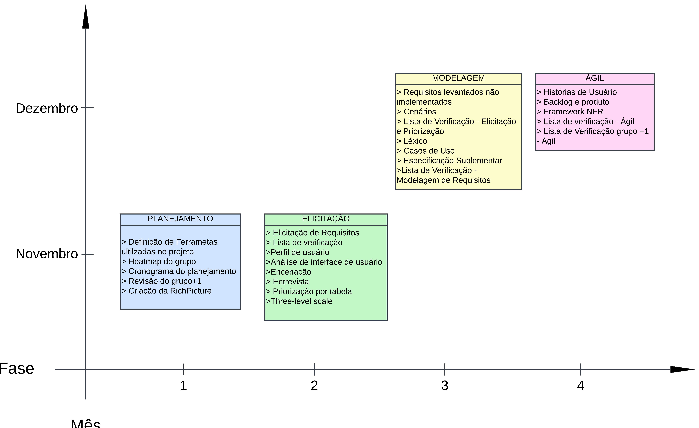

# Baseline

## Introdução

A Baseline de requisitos é um modelo visual que representa o desenvolvimento de um projeto de requisitos. Assim, a baseline "torna-se referência para o desenvolvimento, orientando as várias atividades relacionadas à geração do sistema desejado" [(SERRANO, SERRANO, 2017)](https://aprender3.unb.br/pluginfile.php/2972560/mod_resource/content/1/Requisitos%20-%20Aula%20026.pdf).

## Metodologia

A Baseline é composta por fases do projeto em diferentes versões, dispostas ao longo do tempo de desenvolvimento do projeto. Foram separadas as entregas principais do projeto (planejamento, elicitação, modelagem e ágil) para serem colocadas ao longo de uma linha do tempo vertical dividida em meses de desenvolvimento.

## Execução

A figura 1, a seguir, representa as seções do projeto desenvolvidas ao longo de seu desenvolvimento.

/// caption | <
Figura 1 — Baseline do andamento do projeto, dividido em fases por mês.
///
/// caption
Fonte: Júlia Lopes (Autor)
///

## Referências

| # | Fonte|
|---|:------|
| 1 | SERRANO, Milene. SERRANO, Maurício. Requisitos - Aula 26. UnB Gama (FCTE). Disponível em: [https://aprender3.unb.br/pluginfile.php/2972560/mod_resource/content/1/Requisitos%20-%20Aula%20026.pdf](https://aprender3.unb.br/pluginfile.php/2972560/mod_resource/content/1/Requisitos%20-%20Aula%20026.pdf). Acesso em: 19/01/2025. |

## Histórico

| Versão | Descrição                  | Autor                           | Revisor                  |                 Revisado          | Data       |
|--------|----------------------------|---------------------------------|--------------------------|-----------------------------------|------------|
| v1.0   | Página Criada | Júlia Lopes, Rodrigo Orlandi | Laís Cecília | <input type="checkbox" onclick="return false;" disabled/> | 19/01/2025 |