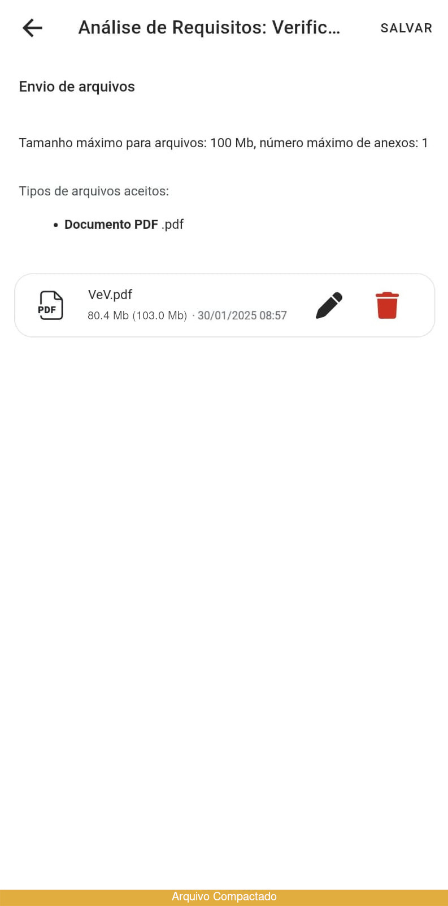

# Protótipos de Requisitos Não Implementados

## Introdução

Validação em software, de acordo com [[SERRANO, SERRANO, 2017]](https://aprender3.unb.br/pluginfile.php/2972537/mod_resource/content/2/Requisitos%20-%20Aula%20023.pdf), é a confirmação de que o produto é aquele desejado pelo usuário.  

Para possibilitar a validação acerca o projeto, foi enviado um e-mail contatando a empresa e uma fala pela equipe de suporte. Além disso, foram desenvolvidos protótipos de alta fidelidade com base nos requisitos não implementados, a fim de oferecer visões sobre possíveis melhoras e novas funcionalidades no sistema.

## Requisitos não implementados escolhidos {#rni}

A tabela 1, a seguir, apresenta os [requisitos não implementados](../../03%20-%20Modelagem/areq_nao_imp.md#requisitos) escolhidos para a prototipação.

| Código  | Tipo de Requisito          | Descrição do Requisito  |  Foi implementado?  | Origem |
|---------|----------------------------|-------------------------|---------------------|--------|
| RE09    |  Requisito Funcional       |  O sistema permite que alunos visualizem as turmas em que já foram cadastrados (arquivadas) | NÃO | ANA13, ANA19 |
| RE21    |  Requisito Funcional       |  O sistema deve possuir um sistema de busca, dentro das disciplinas, para facilitar e simplificar a navegação dos usuários.| NÃO | ENT07 |
| RE25    |  Requisito Não Funcional   |  O sistema deve possuir uma auto-compactação de arquivos se recebê-los exceder o tamanho máximo do arquivo.| NÃO | ENT13 |
| RE28    |  Requisito Funcional       |  O sistema permite a realização de aulas síncronas por chamas de vídeo | NÃO | ANA17 |
| RE31    |  Requisito não Funcional   | Encontrar a barra de busca de turmas é facilmente localizável e intuitiva | NÃO | ENC03 |
/// caption | <
Tabela 1 — Tabela com todos os requisitos elicitados não implementados.
///
/// caption
Fonte: Autores
///

## Protótipos de Alta Fidelidade

### Turmas arquivadas

A figura 1, a seguir, apresenta o prototipo de alta fidelidade desenvolvido a partir do requisito não implementado [**RE09**](#rni): O sistema permite que alunos visualizem as turmas em que já foram cadastrados (arquivadas).

 
/// caption | <
Figura 1 — **Protótipo para o requisito RE09**: Turmas arquivadas.
///
/// caption
Fonte: Rodrigo Orlandi (Autor)
///

---

### Barra de busca

As figuras 2 e 3, a seguir, apresentam os protótipos de alta fidelidade desenvolvidos a partir dos requisitos não implementados [**RE21**](#rni): O sistema deve possuir um sistema de busca, dentro das disciplinas, para facilitar e simplificar a navegação dos usuários; e [**RE31**](#rni): Encontrar a barra de busca de turmas é facilmente localizável e intuitiva.

 
/// caption | <
Figura 2 — **Protótipo para os requisitos RE21 e  RE31**: Ícone de busca na barra de tarefas.
///
/// caption
Fonte: Laís Cecília (Autora)
///

 
/// caption | <
Figura 3 — **Protótipo para os requisitos RE21 e  RE31**: Overlay de busca.
///
/// caption
Fonte: Laís Cecília (Autora)
///

---

### Compactação automática

A figura 4, a seguir, apresenta o protótipo de alta fidelidade desenvolvido a partir do requisito não implementado [**RE25**](#rni): O sistema deve possuir uma auto-compactação de arquivos se recebê-los exceder o tamanho máximo do arquivo.

Note a notificação na parte inferior da tela, além do tamanho do arquivo mostrado como o tamanho comprimido, seguido do tamanho original entre parênteses.

 
/// caption | <
Figura 4 — **Protótipo para o requisito RE09**: Compactação de arquivos.
///
/// caption
Fonte: Laís Cecília (Autora)
///

---

### Aulas síncronas on-line

As figuras 5 a 7, a seguir, apresentam os protótipos desenvolvidos a partir do requisito não implementado [**RE28**](#rni): O sistema permite a realização de aulas síncronas por chamas de vídeo. 

Destas, as figuras 5 e 6 mostram protótipos de alta fidelidade de insíginias que indicam que uma aula síncrona está ocorrendo.

 
/// caption | <
Figura 5 — **Protótipo para o requisito RE28**: Insígnia na página "Meus Cursos".
///
/// caption
Fonte: Laís Cecília (Autora)
///

 
/// caption | <
Figura 6 — **Protótipo para o requisito RE28**: Insígnia na página do curso de Requisitos de Software.
///
/// caption
Fonte: Laís Cecília (Autora)
///

Por sua vez, a figura 7 apresenta um protótipo de média fidelidade de como seria a chamada de vídeo. Aplicando-se padrões conhecidos do formato, que incluem o feed de vídeo do apresentador, os participantes e o bate-papo.

 
/// caption | <
Figura 7 — **Protótipo para o requisito RE28**: Aula síncrona em decorrimento.
///
/// caption
Fonte: Laís Cecília (Autora)
///

## Resposta do Moodle

Inicialmente, foi realizada uma pesquisa por um e-mail de contato do Moodle por meio de buscas no Google, mas não foi encontrado algum canal de contato além do suporte técnico.

O Moodle foi contatado pela equipe para possível validação por meio do contato com a equipe de suporte, no site principal. Foi aberto um ticket de atendimento no dia 30 de Janeiro de 2025, como pode ser conferido na figura 8, a seguir.

  
/// caption | <
Figura 8 — Print da mensagem enviada ao Moodle por meio do suporte com o sistema. 
///
/// caption
Rodrigo Orlandi (Autor)
///

Apesar do ticket ter sido resolvido e o grupo ter recebido notificação por e-mail, a resolução do ticket não pôde ser vista. O e-mail recebido não informa sobre o ticket, apenas denotando que foi resolvido, e quando o login no sistema foi tentado, a equipe não pôde entrar no sistema, como pode-se conferir na imagem 9, a seguir.

  
/// caption | <
Figura 9 — Print da não autorização de logar no sistema. * 
///
/// caption
Rodrigo Orlandi (Autor)
///

Mais contato com o Moodle por meio do e-mail help@moodle.com está sendo tentado.

## Referência

| # | Fonte|
|---|:------|
| 1 | SALES, André Barros de. **Plano_de_Ensino RE 022024 Turma 02 v1**. UnB Gama (FCTE). Disponível em: [https://aprender3.unb.br/pluginfile.php/2972537/mod_resource/content/2/Requisitos%20-%20Aula%20023.pdf](https://aprender3.unb.br/pluginfile.php/2972537/mod_resource/content/2/Requisitos%20-%20Aula%20023.pdf). Acesso em: 03/02/2025. |

## Histórico

| Versão | Descrição                  | Autor                           | Revisor                  |                 Revisado          | Data       |
|--------|----------------------------|---------------------------------|--------------------------|-----------------------------------|------------|
| v1.0   | Página Criada              | Rodrigo Orlandi, Laís Cecília   | Esther Sousa    | <input type="checkbox" onclick="return false;" disabled checked/> | 03/02/2025 |
| v1.1   | Correções, +RE25              | Laís Cecília   | Esther Sousa    | <input type="checkbox" onclick="return false;" disabled/> | 08/02/2025 |