# Lista de Verificação - Grupo

## Introdução

Após a conclusão dos outros artefatos da entrega 2, o grupo realizou a verificação a partir das listas disponibilizadas pelo professor no [Plano de Ensino](https://aprender3.unb.br/pluginfile.php/2972367/mod_resource/content/52/Plano_de_Ensino%20RE%20022024%20Turma%2002%20v1.pdf).

## Checklists

Itens são avaliados das seguintes formas:

* Conforme: O projeto satifaz a condição.
* Sugestão de Melhoria: Projeto satisfaz a condição, porém há margem para melhorias. Exige observação.
* Não conforme: O projeto não satifaz a condição.

As tabelas 1 a 8, a seguir, representam as listas de verificação desenvolvidas para cada etapa do projeto.

=== "Elicitação - Personas"
    | Item | Descrição | Verificação | Observação  | Autor |
    |------|:----------|-------------|-------------|----------|
    |  1   | As personas utilizadas no projeto representam, com grande precisão, os usuários finais do software. [4, p. 167] 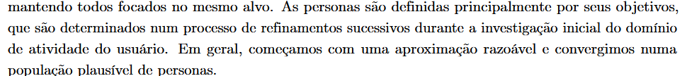| Conforme | - | Júlia Lopes |
    |  2   | Todos os membros da equipe conhecem as personas e as tratam como um membro real da equipe. [4, p. 169] 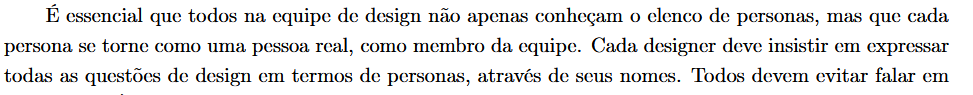 | Não conforme  | - | Júlia Lopes |
    |  3   | A utilização de personas permitiu que a equipe ganhasse uma visão mais clara dos objetivos dos usuários. [4, p. 169] 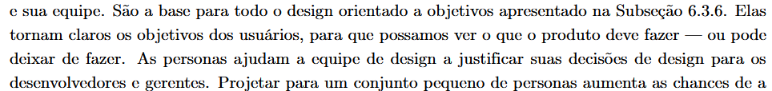| Conforme | - | Júlia Lopes |
    |  4   | O elenco desenvolvido pela equipe de personas consiste em 3 a 12 personas distintas. [4, p. 169] 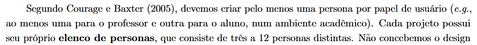 | Conforme | - | Júlia Lopes |
    |  5   | As personas desenvolvidas no projeto possuem características que as tornem distintas e memoráveis. [4, p. 169] 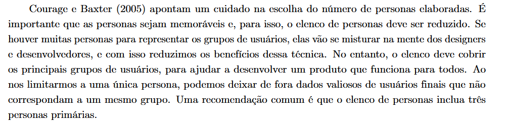 | Sugestão de Melhoria | Personas possuem características que as tornam diferentes uma da outra, mas não de forma memorável. | Júlia Lopes |
    |  6  | Os usuários estão categorizados em grupos definidos pelas suas semelhanças como por exemplo: Idade, experiência, atitudes e tarefas primárias? [4, p. 166] 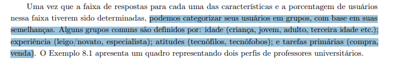 | Não conforme | - | Esther Silva |
    |  7  | As personas foram definidos contendo sua identidade, status, objetivos, habilidades,tarefas, relacionamentos, requisitos e expectativas? [4, p. 167, 168]  | Conforme | - | Esther Silva |
    |  8  | No elenco de personas criado possui pelo menos uma persona primária? [4, p. 169] 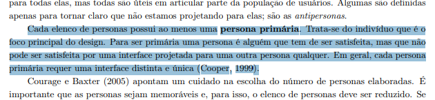| Conforme | - | Esther Silva |
    /// caption | <
    #### Tabela 1 — Lista de verificação de elicitação {#__tabbed_1_1 data-toc-label='Elicitação - Personas'}
    ///
    /// caption
    Fonte: Autores
    ///

=== "Elicitação - Entrevista"
    | Item | Descrição | Verificação | Observação  | Autor |
    |------|:----------|-------------|-------------|----------|
    |  1  | As perguntas da entrevista forma formuladas de forma clara e objetiva? [1, p. 169]  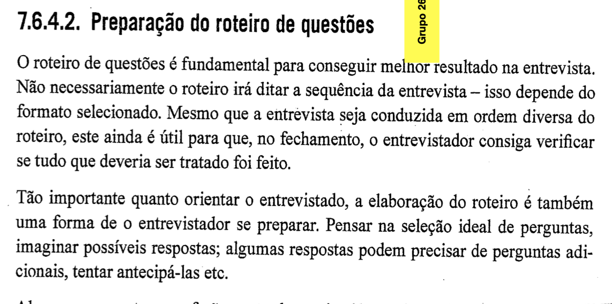| Conforme | - | João Paulo |
    |  2  | Os entrevistados foram informados sobre o propósito da pesquisa?[1, p. 174]  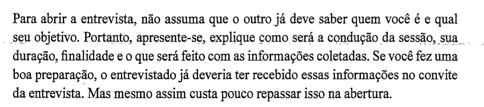 | Conforme | - | João Paulo |
    |  3  | As respostas dos entrevistados foram registradas de forma precisa? [1, p. 173]   | Conforme | - | João Paulo |
    |  4  | Os entrevistados tiveram a oportunidade de fazer perguntas ou abordar assuntos que esquecemos durante a entrevista? [1, pág 174,175]      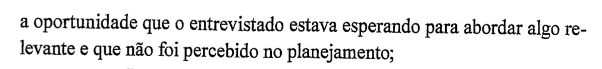 | Sugestão de Melhoria | - | João Paulo |
    |  5  | Os entrevistadores já tinha formulado um roteiro préviamente?[1, pág 169] 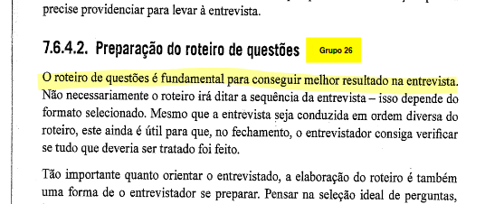 | Conforme | - | João Paulo, Laís Cecília |
    |  6  | Foi apresentado o planejamento da atividade? [1, p. 141] 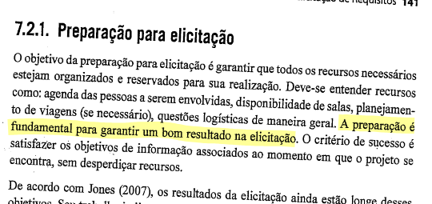 | Conforme | - | Laís Cecília |
    |  7  | Os objetivos da entrevista foram claramente definidos antes de sua realização? [1, p. 167] 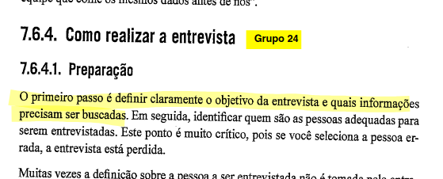| Conforme | - | Laís Cecília |
    |  8  | Os entrevistados selecionados foram adequados, da forma como definido na preparação? [1, p. 167] 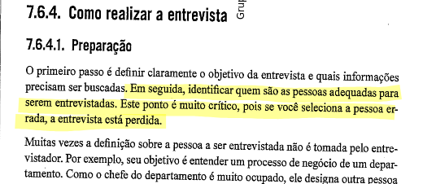 | Conforme | - | Laís Cecília |
    |  9  | Os entrevistados foram apresentados um termo de consentimento, e suas assinaturas coletadas? [1, p. 172] 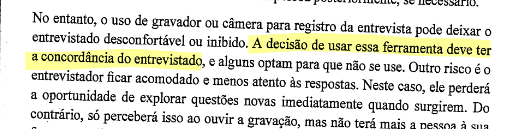| Conforme | - |  Laís Cecília|
    |  10  | O termo de consentimento captura adequadamente o consentimento à entrevista, gravação e a disponibilização das mesmas em meio acadêmico? | Conforme | - | Laís Cecília |
    |  11  | Foram entrevistadas pessoas diversas, de forma a proporcionar perspectivas diferentes e relevantes? [1, p. 168] 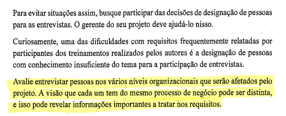 | Sugestão de Melhoria | Faltou entrevistar um professor |Laís Cecília |
    |  12  | A entrevista ocorreu em local adequado, visando minimizar interrupções e distrações? [1, p. 168] 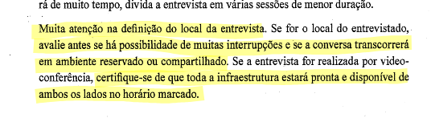 | Conforme | - | Laís Cecília |
    |  13  | As perguntas formuladas possuem complexidade adequada? Isto é, nem tão simples nem tão complicadas. [1, p. 169, 171] 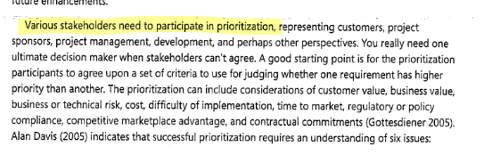  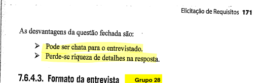 | Sugestão de Melhoria | As perguntas foram bastante simples; isso se encaixa com os objetivos estabelecidos para a entrevista, porém ainda sim as perguntas poderiam ter sido mais complexas | Laís Cecília |
    |  14  | Foi disponibilizada a gravação da entrevista? [1, p. 173] 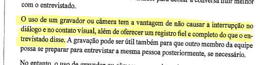| Conforme | - | Laís Cecília |
    /// caption | <
    #### Tabela 2 — Lista de verificação de elicitação {#__tabbed_1_2 data-toc-label='Elicitação - Entrevista'}
    ///
    /// caption
    Fonte: Autores
    ///

=== "Priorização"
    | Item | Descrição | Verificação | Observação | Autor |
    |------|:----------|-------------|-------------|----------------|
    |  1   | O processo de priorização teve a participação de diversas categorias de stakeholders? [3, p. 315]  | Conforme | - | Laís Cecília, Júlia Lopes |
    |  2   | O significado de cada nível de prioridade é claramente  expressado? [3, p. 319] 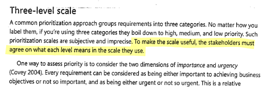| Sugestão de Melhoria | Poderia ter mostrado um gráfico que demonstra como funcionam os níveis | Laís Cecília |
    |  3   | A priorização teve atenção com a interdependência entre requisitos? [3, p. 320] 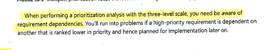| Não conforme | - | Laís Cecília |
    |  4   | O projeto contém requisitos que são ambos importantes e urgentes.[3, p. 319] 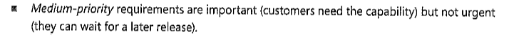 | Não conforme | - | Júlia Lopes |
    |  5   | Todos os requisitos do projeto tiveram sua importância e urgência definidas. [3, p. 319] | Sugestão de Melhoria | Só contém importância | Júlia Lopes, João Paulo |
    |  6   | A priorização dos requisitos foram documentadas de forma que leitores futuros entendam se às prioridades são hereditárias ou especificas do requisito. [3, p. 319] 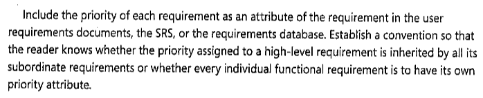| Conforme | - | Júlia Lopes |
    |  7  | Existe um entendimento comum entre os stakeholders sobre o que cada nível de prioridade significa? [3, pág 319] | Não conforme | Ao fazermos a priorização, não utilizamos nenhum usuário do aplicativo, que atuaria com stackholder, por falta de tempo. | João Paulo |
    |  8  | A priorização foi realizada de forma iterativa, se necessário, para garantir que as prioridades estejam corretas? [3, pág 320] 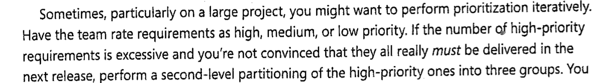 | Não conforme | Ao fazermos a priorização, não utilizamos nenhum usuário do aplicativo, por falta de tempo. | João Paulo |
    /// caption | <
    #### Tabela 3 — Lista de Verificação de técnicas de priorização. {#__tabbed_1_3 data-toc-label='Priorização'}
    ///
    /// caption
    Fonte: Autores
    ///

=== "Cenários"
    | Item | Descrição | Verificação | Observação  | Autor |
    |------|:----------|-------------|-------------|----------------|
    |  1   | Os cenários seguem um modelo conciso? [4, p. 172] 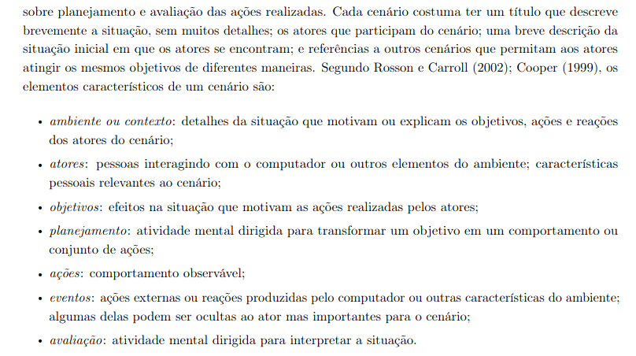| Conforme | - | Laís Cecília |
    |  2   | Os cenários possuem os elementos definidos por Barbosa et al.(2021)? [4, p. 172] | Conforme | Poderia ter mostrado um gráfico que demonstra como funcionam os níveis | Laís Cecília |
    |  3   | Os cenários possuem exceções? [4, p. 172] 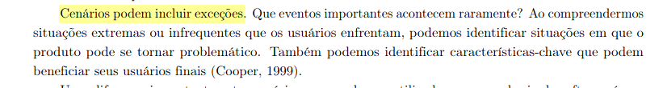| Conforme | - | Laís Cecília |
    |  4   | Os cenários feitos descrevem o comportamento, experiencia e objetivos de forma clara.[4, p. 172] 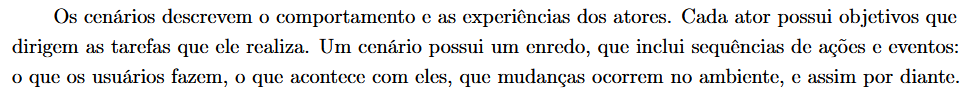 | Conforme | - | Júlia Lopes |
    |  5   | Os cenários realizados possuem um título informativo e breve e uma descrição da situação inicial. [4, p. 172] 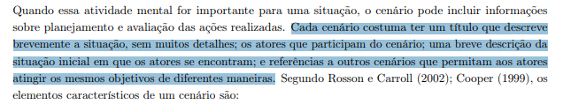| Conforme | - | Esther Silva, Júlia Lopes |
    |  6   | O ator dos cenários inclui características pessoais relevantes aos cenários específicos. [4, p. 172] 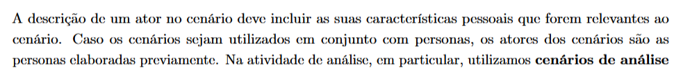 | Conforme | - | Júlia Lopes |
    |  7   | Durante o processo de encenação foi apresentado situações raras/exceções/cenários que o produto pode agir de forma problemática.[4, p. 173] 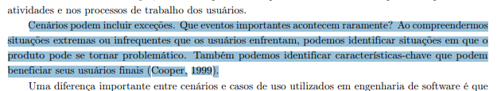| Não conforme | - |  Esther Silva, Júlia Lopes, João Paulo |
    |  8   | Os cenários incluem um contexto que descreve as pré-condições? [5, p. 49] 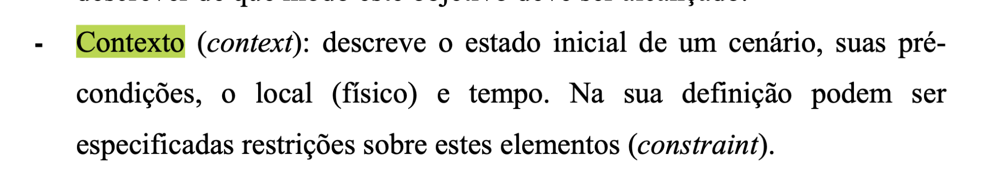| Conforme | - | João Paulo |
    |  9  | Os cenários descrevem interações claras entre os atores e o sistema? [5, p. 48]  | Conforme | - | João Paulo |
    |  10  | A fim de deixar os cenários com informações mais concretas, foi usada a técnica de questionamento sistemático? [4, p. 172] | Conforme | - | Esther Silva |
    /// caption | <
    #### Tabela 4 — Lista de Verificação de cenários. {#__tabbed_1_4 data-toc-label='Cenários'}
    ///
    /// caption
    Fonte: Autores
    ///

=== "NFR Framework"
    | Item | Descrição | Verificação | Observação |  Autor |
    |------|:----------|-------------|-------------|----------------|
    |  1   | O projeto possui ambos requisitos funcionais e não funcionais.[6, p. 30] 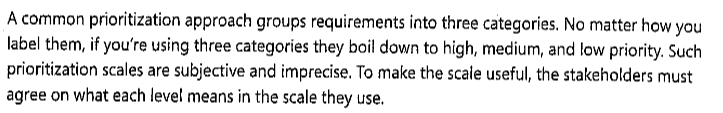| Conforme | - | Júlia Lopes |
    |  2   | Os requisitos funcionais e não funcionais estão organizados em um catálogo de forma hierárquica em relação ao desenvolvimento do projeto.[6, p. 31] 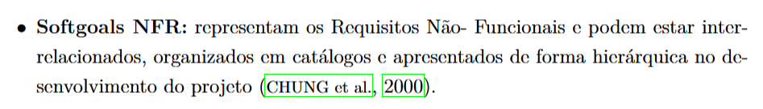| Sugestão de Melhoria | Hierárquica não é baseada ao desenvolvimento do projeto | Júlia Lopes |
    |  3   | O projeto possue soluções de implementações que satisfazem os softgoals.[6, p. 31] 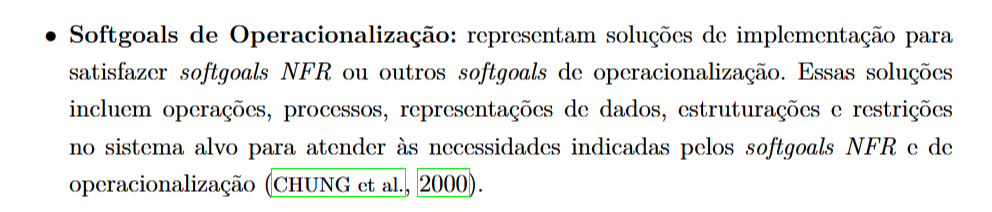|Sugestão de Melhoria | Faz sugestões, mas nem todos possuem soluções | Júlia Lopes |
    |  4   | O Softgoal Interdependency Graph (SIG) foi utilizado para visualizar interdependências? [6, p. 45] 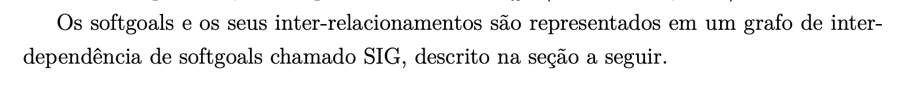| Conforme | - | João Paulo |
    |  5   | Os softgoals estão definidos e bem documentados? [6, p. 31] 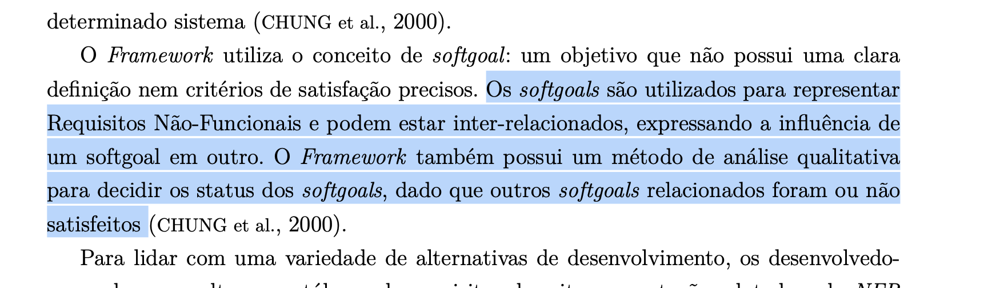| Conforme | - | João Paulo |
    |  6   | As restrições e exceções relevantes são consideradas na análise dos requisitos? [6, p. 43] | Conforme | - | João Paulo | 
    /// caption | <
    #### Tabela 5 — Lista de Verificação de NFR Framework. {#__tabbed_1_5 data-toc-label='NFR Framework'}
    ///
    /// caption
    Fonte: Autores
    ///

=== "História de Usuário e Backlog"
    | Item | Descrição | Verificação | Observação | Autor |
    |------|:----------|-------------|-------------|----------------|
    |  1   | O desenvolvimento dos épicos foi feito de forma que sua estrutura fui utilizada corretamente. [7, p. 13] 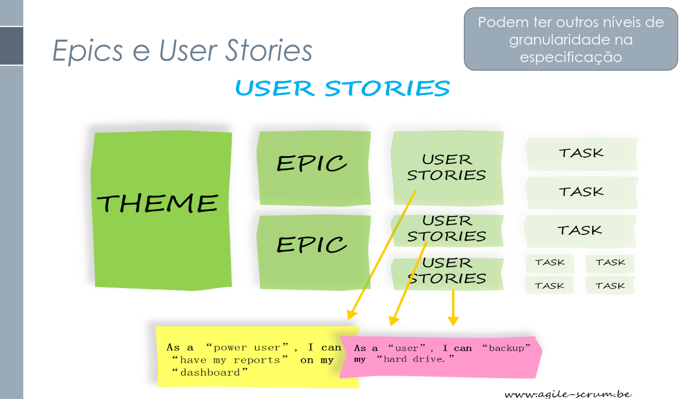 | Conforme | - | Júlia Lopes | 
    |  2   | Os épicos desenvolvidos no projeto satisfez as expectativas reais dos usuários. [7, p. 14]  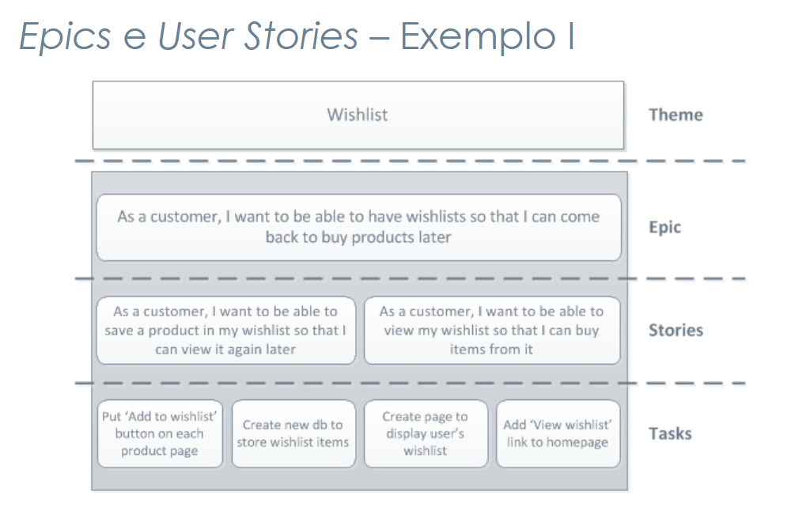| Sugestão de Melhoria | Alguns não satisfizeram |  Júlia Lopes  | 
    |  3   | Todas as histórias de usuário foram avaliadas pelo cliente/usuário final [10, p. 88]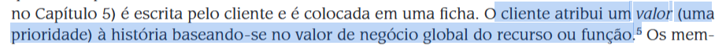 | Conforme | - |  Júlia Lopes  | 
    |  4   | As histórias de usuário foram criadas pelos próprios clientes [10, p. 88] 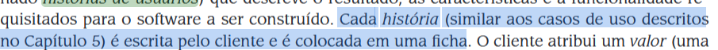| Não conforme | - |  Júlia Lopes  | 
    |  5   | As histórias de usuários (User Stories) estão especificadas de forma clara e concisa? [7, p. 11]  | Conforme | - | João Paulo | 
    |  6   | As histórias de usuário estão agrupadas em épicos, e estes em temas? [7, p. 13]  | Conforme | - | Laís Cecília, João Paulo | 
    |  7   | As histórias de usuário seguem o formato destacado por Serrano, Milene e Serrano, Maurício(2017?)? (Eu, como QUEM, quero O QUE, POR QUE) [7, p. 12] 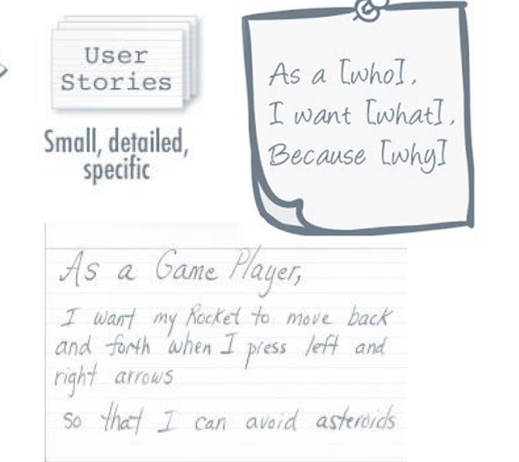| Conforme | - | João Paulo, Laís Cecília | 
    |  8   | O product backlog lista as funcionalidades do produto, atuais ou desejadas? [7, p. 8] 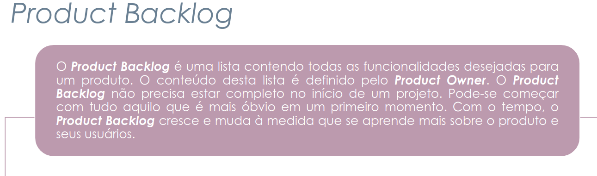| Conforme | - | Laís Cecília, João Paulo | 
    |  9   | Os requisitos no backlog são representados por histórias de usuário? [7, p. 11] | Conforme | - | Laís Cecília | 
    |  10  | As histórias de usuários têm critérios de aceitação? [7, p. 12]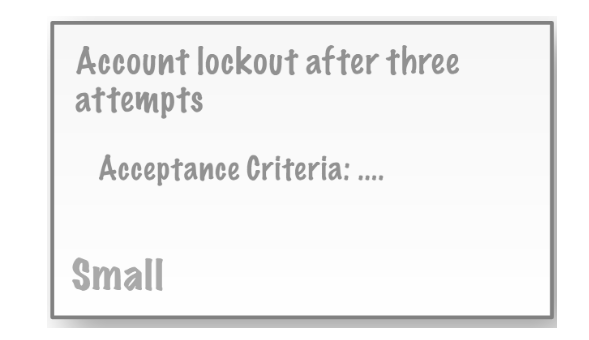| Conforme | - | Laís Cecília, João Paulo | 
    |  11  | As histórias de usuário têm prioridades atribuídas a elas? [10, p. 124]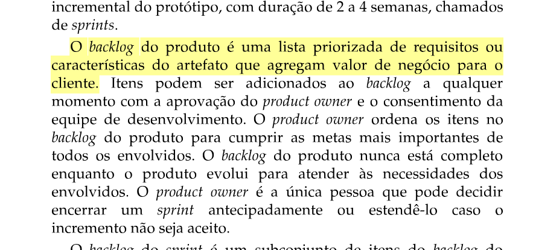| Conforme | - | Laís Cecília | 
    /// caption | <
    #### Tabela 6 — Lista de Verificação de histórias de usuário e backlog. {#__tabbed_1_6 data-toc-label='US e Backlog'}
    ///
    /// caption
    Fonte: Autores
    ///

=== "Rastreabilidade"
    | Item | Descrição | Verificação | Observação  | Autor |
    |------|:----------|-------------|----------------|----------------|
    |  1   | Os requisitos estão claramente ligados às suas fontes durante a pré-rastreabilidade? [8, p. 6] 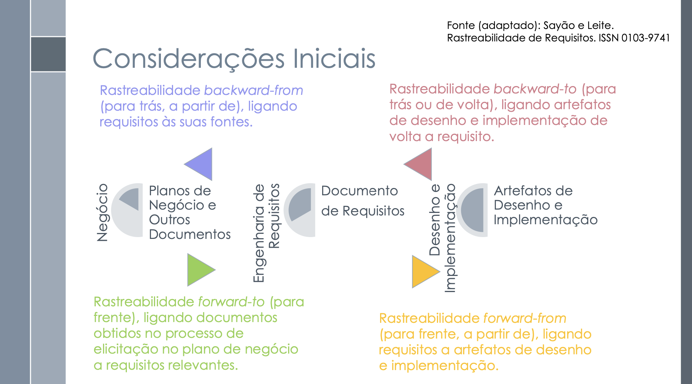| Conforme | - |João Paulo | 
    |  2   | Foi possível realizar a verificação de se um requisito foi implementado no sistema de forma apropriada.[9, p. 122] 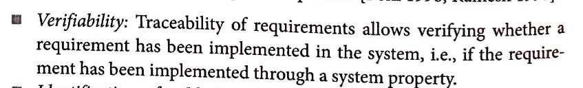| Conforme | - | Júlia Lopes | 
    |  3   | As informações anotadas sobre o sistema foi realizada com um propósito claro [9, p. 123] 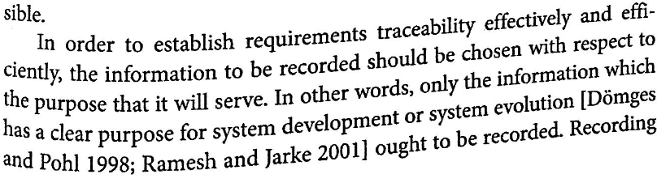| Sugestão de Melhoria | Nem todas as informações foram anotadas de forma clara | Júlia Lopes | 
    |  4   | Existem links de rastreabilidade ligando requisitos às suas fontes? [8, p. 5] 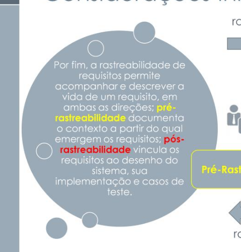| Conforme | - | Laís Cecília | 
    |  5   | Existem links de rastreabilidade ligando artefatos aos requisitos que os originaram?[8, p. 5] | Conforme | - | Laís Cecília | 
    |  6   | Os elos de rastreabilidade estão classificados de acordo com o meta-modelo de Toranzo?[8, p. 22] 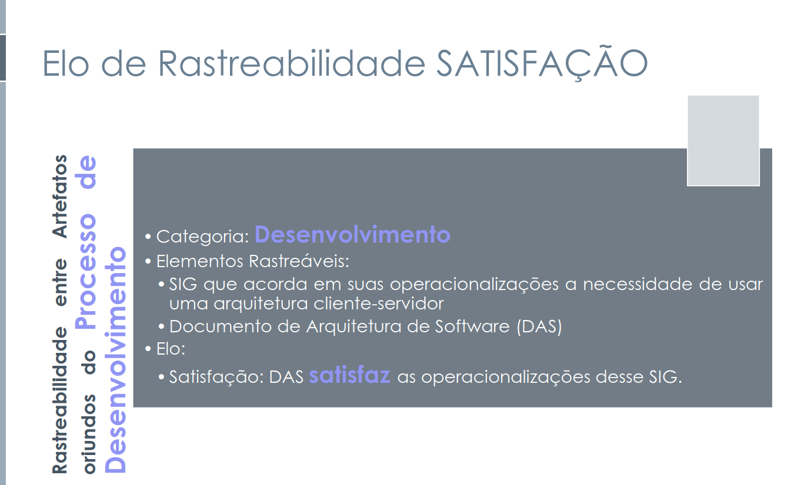| Conforme | - | Laís Cecília | 
    /// caption | <
    #### Tabela 7 — Lista de Verificação de rastreabilidade. {#__tabbed_1_7 data-toc-label='Rastreabilidade'}
    ///
    /// caption
    Fonte: Autores
    ///

=== "Elos de Toranzo"
    | Item | Descrição | Verificação | Observação  | Autor |
    |------|:----------|-------------|---------------------------------|----------------|
    |  1   | Os elos são especificados seguindo o meta-modelo de Toranzo? [8, p.22]  | Conforme | - | João Paulo, Júlia Lopes, Laís Cecília | 
    |  2   | Cada tipo de elo está bem explicado no projeto? [8, p. 22] | Conforme  | - | João Paulo | 
    |  3   | Existe uma análise da interdependência entre os elos? [8, p. 39] | Conforme | - | João Paulo | 
    |  5   | Os elos selecionados para os requisitos satisfazem a classificação desses requisitos. [8, p.21] | Conforme | - | Júlia Lopes | 
    |  6   | Cada requisito contém pelo menos um elemento rastreável.[8, p.22]  | Conforme | - | Júlia Lopes | 
    |  8   | Os elos são categorizados da forma como identificada pelo modelo? [11, p. 9,10]     | Conforme | - | Laís Cecília | 
    /// caption | <
    #### Tabela 8 — Lista de Verificação de elos de Toranzo. {#__tabbed_1_8 data-toc-label='Elos de Toranzo'}
    ///
    /// caption
    Fonte: Autores
    ///

---
## Referência

| # | Fonte|
|---|:------|
|1 | VASQUEZ, Carlos E.; SIMÕES, Guilherme S. **Engenharia de Requisitos**: Software Orientado ao Negócio. Brasport, 2016.|
|~~2~~ | ~~Barbosa, Simone. Gasparini, Isabela. **Interação Humano Computador e Experiência do Usuário.**~~|
|3 | WIEGERS, Karl; BEATTY, Joy. **Software Requirements**. Pearson Education. 3 ed. 2013.|
|4 | Barbosa, S. D. J.; Silva, B. S. da; Silveira, M. S.; Gasparini, I.; Darin, T.; Barbosa, G. D. J. (2021). **Interação Humano-Computador e Experiência do Usuário**. Autopublicação|
|5 |  LEITE, J. C. S. dP.. **Cenários:** Rastreamento de Cenários. PUC-Rio, 2003. Acessível em: [https://www-di.inf.puc-rio.br/~julio/bnncap3.pdf](https://www-di.inf.puc-rio.br/~julio/bnncap3.pdf)|
|6 | SILVA, Reinaldo Antônio da. **NFR4ES**: Um Catálogo de Requisitos Não-Funcionais para Sistemas Embarcados. Universidade Federal de Pernambuco, 2019. Disponível em: <https://aprender3.unb.br/pluginfile.php/2972515/mod_resource/content/2/DISSERTAÇÃO%20Reinaldo%20Antônio%20da%20Silva.pdf > Acesso em: 20 jan. 2025.|
|7 | SERRANO, Milene. SERRANO, Maurício. **Requisitos** - Aula 15. UnB Gama (FCTE). Disponível em: <https://aprender3.unb.br/pluginfile.php/2972504/mod_resource/content/1/Requisitos%20-%20Aula%2015a.pdf.> Acesso em: 21/01/2025.|
|8 | SERRANO, Milene. SERRANO, Maurício. **Requisitos** - Aula 26. UnB Gama (FCTE). Disponível em: <https://aprender3.unb.br/pluginfile.php/2972560/mod_resource/content/1/Requisitos%20-%20Aula%20026.pdf > Acesso em: 22/01/2025.|
|9 |  POHL, Klaus. Re**quirement Engineering Fundamentals**|
|10 | PRESSMAN, Roger S; MAXIM, Bruce R. Engenharia de Software: Uma Abordagem Profissional. AMGH Editora LTDA, 9a ed. 2021.|
|11 | SAYÃO, M; LEITE, J.C. Rastreabilidade de Requisitos. PUC-Rio, Rio de Janeiro. 2005.|

## Histórico

| Versão | Descrição                  | Autor                           | Revisor                  |                 Revisado          | Data       |
|--------|----------------------------|---------------------------------|--------------------------|-----------------------------------|------------|
| v1.0   | Página Criada              | João Paulo, Júlia Lopes              | Esther Sousa                      | <input type="checkbox" onclick="return false;" disabled checked/> | 01/02/2025 |
| v1.1   | Correções e imagens        | Laís Cecília                    | João Paulo                | <input type="checkbox" onclick="return false;" disabled/> | 08/02/2025 |