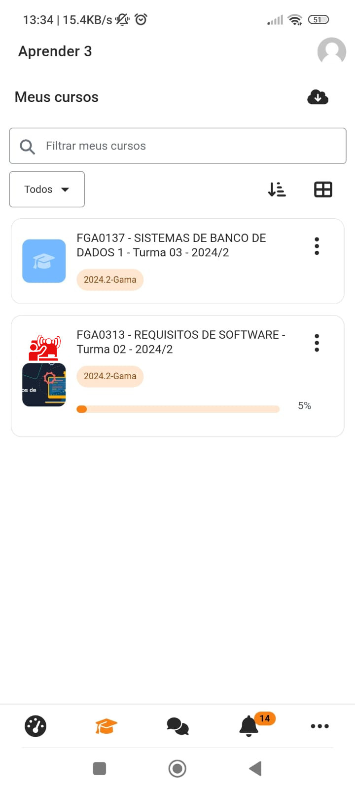
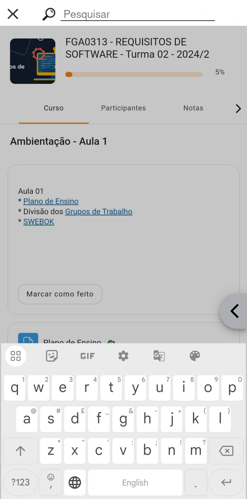
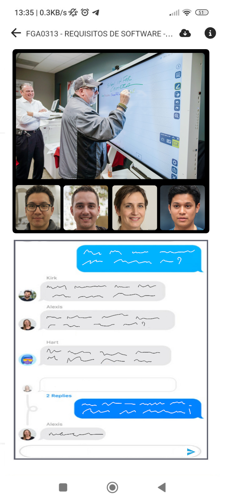
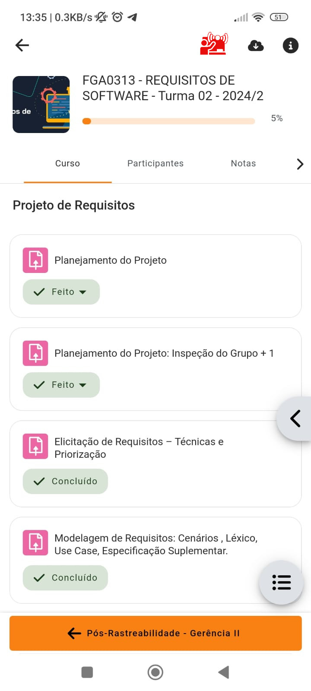
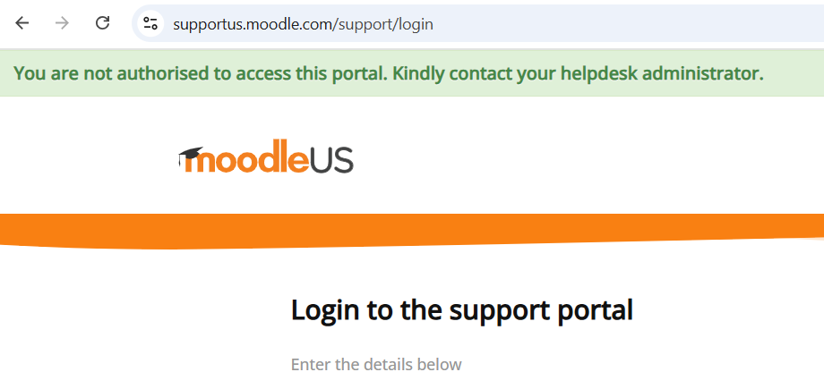

# Protótipos de Requisitos Não Implementados

## Introdução

Validação em software, de acordo com [[SERRANO, SERRANO, 2017]](https://aprender3.unb.br/pluginfile.php/2972537/mod_resource/content/2/Requisitos%20-%20Aula%20023.pdf), é a confirmação de que o produto é aquele desejado pelo usuário.  

Para possibilitar a validação acerca o projeto, foi enviado um e-mail contatando a empresa e uma fala pela equipe de suporte. Além disso, foram desenvolvidos protótipos de alta fidelidade com base nos requisitos não implementados, a fim de oferecer visões sobre possíveis melhoras e novas funcionalidades no sistema.

## Lista de Requisitos não Implementados

A tabela 1, a seguir, apresenta os requisitos não implementados no Moodle do projeto, transferidos do artefato de [Requisitos Não Implementados](https://requisitos-de-software.github.io/2024.2-Moodle/Entregas/03%20-%20Modelagem/areq_nao_imp/#requisitos).

| Código  | Tipo de Requisito          | Descrição do Requisito  |  Foi implementado?  | Origem |
|---------|----------------------------|-------------------------|---------------------|--------|
| RE09    |  Requisito Funcional       |  O sistema permite que alunos visualizem as turmas em que já foram cadastrados (arquivadas) | NÃO | ANA13, ANA19 |
| RE20    |  Requisito Não Funcional   |  A navegação do aplicativo mobile deve ter símbolos grandes e posicionados de maneira a tornar a navegação mais simples, com presença de diversos atalhos. | NÃO | ANA15, ENT06 |
| RE21    |  Requisito Funcional       |  O sistema deve possuir um sistema de busca, dentro das disciplinas, para facilitar e simplificar a navegação dos usuários.| NÃO | ENT07 |
| RE22    |  Requisito Não Funcional   |  O sistema deve ter um tempo de resposta menor ou igual a dois segundos para cada clique. | NÃO | ENT09 |
| RE25    |  Requisito Não Funcional   |  O sistema deve possuir uma auto-compactação de arquivos se recebê-los exceder o tamanho máximo do arquivo.| NÃO | ENT13 |
| RE26    |  Requisito Funcional       |  O sistema deve automaticamente considerar conteúdos dados, atividades corrigidas, notas de prova e de projetos, resumindo-os em uma porcentagem de conclusão da disciplina.| NÃO |ENT15 |
| RE28    |  Requisito Funcional       |  O sistema permite a realização de aulas síncronas por chamas de vídeo | NÃO | ANA17 |
| RE29    |  Requisito Funcional       |  O sistema integra outros aplicativos da mesma família para uso da turma | NÃO | ANA25 |
| RE31    |  Requisito não Funcional   | Encontrar a barra de busca de turmas é facilmente localizável e intuitiva | NÃO | ENC03 |
/// caption | <
#### Tabela 1 — Tabela com todos os requisitos elicitados não implementados. {#rni data-toc-label='Requisitos não implementados'}
///
/// caption
Fonte: Autores
///

## Protótipos de Alta Fidelidade

As imagens 1 a 4 a seguir, representam os protótipos de alta fidelidade desenvolvidos a partir dos requisitos não implementados escolhidos. 

 
 **Figura 1**: Protótipo de alta fidelidade desenvolvido com base no site do Moodle. Requisito utilizado: RE09. **Fonte**: Rodrigo (Autor). 

 
 **Figura 2**: Protótipo de alta fidelidade desenvolvido com base no aplicativo do Moodle. Requisito utilizado: RE21. **Fonte**: Laís (Autora). 

  
 **Figura 3**: Protótipo de alta fidelidade desenvolvido com base no aplicativo do Moodle. Requisito utilizado: RE21. **Fonte**: Laís (Autora). 

  
 **Figura 4**: Protótipo de alta fidelidade desenvolvido com base no aplicativo do Moodle. Requisito utilizado: RE28. **Fonte**: Laís (Autora). 

  
 **Figura 5**: Protótipo de alta fidelidade desenvolvido com base no aplicativo do Moodle. Requisito utilizado: RE28. **Fonte**: Laís (Autora). 

## Resposta do Moodle

Inicialmente, foi realizada uma pesquisa por um e-mail de contato do Moodle por meio de buscas no Google, mas não foi encontrado algum canal de contato além do suporte técnico.

O Moodle foi contatado pela equipe para possível validação por meio do contato com a equipe de suporte, no site principal. Foi aberto um ticket de atendimento no dia 30 de Janeiro de 2025, como pode ser conferido na figura 6, a seguir.

 
**Figura 6**: Print da mensagem enviada ao Moodle por meio do suporte com o sistema. **Fonte**: Rodrigo (Autor). 

Apesar do ticket ter sido resolvido e o grupo ter recebido notificação por e-mail, a resolução do ticket não pôde ser vista. O e-mail recebido não informa sobre o ticket, apenas denotando que foi resolvido, e quando o login no sistema foi tentado, a equipe não pôde entrar no sistema, como pode-se conferir na imagem 7, a seguir.

 
**Figura 7**: Print da não autorização de logar no sistema. **Fonte**: Rodrigo (Autor). 

Mais contato com o Moodle por meio do e-mail [help@moodle.com](help@moodle.com) está sendo tentado.

## Referência

| # | Fonte|
|---|:------|
| 1 | SALES, André Barros de. **Plano_de_Ensino RE 022024 Turma 02 v1**. UnB Gama (FCTE). Disponível em: [https://aprender3.unb.br/pluginfile.php/2972537/mod_resource/content/2/Requisitos%20-%20Aula%20023.pdf](https://aprender3.unb.br/pluginfile.php/2972537/mod_resource/content/2/Requisitos%20-%20Aula%20023.pdf). Acesso em: 03/02/2025. |

## Histórico

| Versão | Descrição                  | Autor                           | Revisor                  |                 Revisado          | Data       |
|--------|----------------------------|---------------------------------|--------------------------|-----------------------------------|------------|
| v1.0   | Página Criada              | Rodrigo Orlandi, Laís Cecília   | Esther Sousa    | <input type="checkbox" onclick="return false;" disabled checked/> | 03/02/2025 |