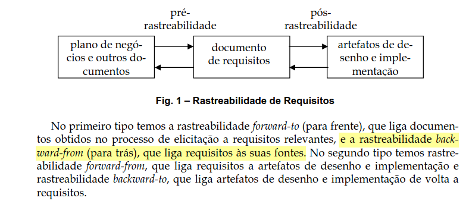
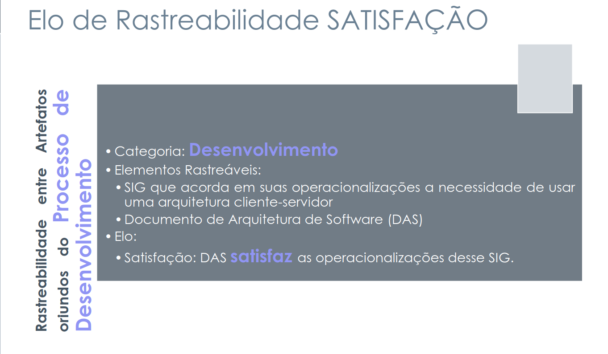

# Lista de Verificação - Pós-Rastreabilidade

## Introdução

Após a conclusão dos outros artefatos da entrega 6, o grupo realizou a verificação a partir da lista disponibilizada pelo professor no [Plano de Ensino](https://aprender3.unb.br/pluginfile.php/2972367/mod_resource/content/52/Plano_de_Ensino%20RE%20022024%20Turma%2002%20v1.pdf), além de uma lista elaborada por nós.

## Data de realização

19/01/25 das 21:15 às 21:35.

## Gravação

<iframe width="500" height="285" src="https://www.youtube.com/embed/EgZLCfmgd6Y?si=tpT7gzACspWxMoz2" title="YouTube video player" frameborder="0" allow="accelerometer; autoplay; clipboard-write; encrypted-media; gyroscope; picture-in-picture; web-share" referrerpolicy="strict-origin-when-cross-origin" allowfullscreen></iframe>

## Checklists

Itens são avaliados das seguintes formas:

* Conforme: Projeto satisfaz a condição.
* Sugestão de Melhoria: Projeto satisfaz a condição, porém há margem para melhorias. Exige observação.
* Não conforme: Projeto NÃO satisfaz a condição.
  

As tabelas 1 e 2, a seguir, contém as listas de verificação.

=== "Desenvolvimento geral do projeto"

    | Item | Descrição | Verificação | Observação | Versão, data e hora da avaliação |
    |------|:----------|-------------|-------------|---------------------|
    |  1   | O histórico de versão está padronizado?                                                                                                        | Conforme | - | tudo v1.0 - 19/01/25 - 21:25 |
    |  2   | O(s) autor(es) e o(s) revisor(es) para cada artefato?                                                                                          | Conforme | - | tudo v1.0 - 19/01/25 - 21:25 |
    |  3   | Referências bibliográficas e/ou bibliografia em todos os artefatos                                                                             | Conforme | - | tudo v1.0 - 19/01/25 - 21:25 |
    |  4   | As tabelas e imagens possuem legenda e fonte e elas chamadas dentro do texto?                                                                  | Conforme | - | tudo v1.0 - 19/01/25 - 21:26 |
    |  5   | Um texto fazendo uma introdução dos artefatos?                                                                                                 | Conforme | - | matriz de requisitos v1.1, cronograma v1.1, resto v1.0 - 19/01/25 - 21:28 |
    |  6   | O cronograma executado com quem realizou cada artefato/atividade com as datas de início e fim da construção/realização do artefato/atividade.  | Conforme | - | v1.0 - 19/01/25 - 21:30 |
    |  7   | Ata(s) da(s) reuniões (com data, horário de início e do final, participantes, objetivo, atividades definidas etc).                             | Conforme | - | v1.0 - 19/01/25 - 21:31 |
    |  8   | A gravação da reunião do grupo.                                                                                                                | Conforme* | Video renderizando durante a verificação | v1.0 - 19/01/25 - 21:32 |
    |  9   | Vídeo de apresentação na categoria “não listado” no youtube?                                                                                   | Conforme | - | v1.0 - 19/01/25 - 21:33 |
    /// caption | <
    #### Tabela 1 — Checklist do desenvolvimento geral do projeto { #__tabbed_1_1 data-toc-label="Desenvolvimento geral do projeto" }
    ///
    /// caption
    Fonte: André Barros
    ///

=== "Pós-rastreabilidade"

    | Item | Descrição | Verificação | Observação | Versão, data e hora da avaliação |
    |------|:----------|-------------|-------------|---------------------|
    |  1   | Cada membro do grupo elaborou ao menos 5 elos de rastreabilidade?                | Conforme | - | v1.0 - 19/01/25 - 21:18 |
    |  2   | Cada requisito está rastreado à sua(s) origem(ns), e o elo especificado? (rastreabilidade Backward-from)[^3^](#referencia) | Conforme | - | v1.0 - 19/01/25 - 21:19 |
    |  3   | Os elos são especificados seguindo o meta-modelo de Toranzo? [^2^](#referencia)                     | Conforme | - | v1.0 - 19/01/25 - 21:20 |
    |  4   | Cada requisito está rastreado ao(s) artefato(s) que originou? (rastreabilidade Forward-from)[^3^](#referencia) | Conforme | - | v1.0 - 19/01/25 - 21:22 |
    |  5   | Existe uma matriz que agrega a rastreabilidade Forward-from e Backward-from?  | Conforme | - | v1.0 - 19/01/25 - 21:23|
    /// caption | <
    #### Tabela 2 — Checklist de pós-rastreabilidade { #__tabbed_1_2 data-toc-label="Pós-rastreabilidade" }
    ///
    /// caption
    Fonte: Autores
    ///

---

## Referência

| # | Fonte|
|---|:------|
| 1 | SALES, André Barros de. **Plano_de_Ensino RE 022024 Turma 02 v1**. UnB Gama (FCTE). Disponível em: [https://aprender3.unb.br/pluginfile.php/2972367/mod_resource/content/52/Plano_de_Ensino%20RE%20022024%20Turma%2002%20v1.pdf](https://aprender3.unb.br/pluginfile.php/2972367/mod_resource/content/52/Plano_de_Ensino%20RE%20022024%20Turma%2002%20v1.pdf). Acesso em: 17/12/2024. |
| 2 | SERRANO, Milene; SERRANO, Maurício. **Requisitos** - Aula 26. Disponível em: [https://aprender3.unb.br/pluginfile.php/2972560/mod_resource/content/1/Requisitos%20-%20Aula%20026.pdf](https://aprender3.unb.br/pluginfile.php/2972560/mod_resource/content/1/Requisitos%20-%20Aula%20026.pdf)
| 3 | SAYÃO Miriam, LEITE Julio. **Rastreabilidade de Requisitos**. 2005, PUC-RJ. |

## Histórico

| Versão | Descrição                  | Autor                           | Revisor                  |                 Revisado          | Data       |
|--------|----------------------------|---------------------------------|--------------------------|-----------------------------------|------------|
| v1.0   | Página Criada              | Laís Cecília |  João Paulo                        | <input type="checkbox" onclick="return false;" disabled checked/> | 19/01/2025 |
| v1.1   | Checklist preenchida       | Laís Cecília | Esther Sousa                       |<input type="checkbox" onclick="return false;" disabled checked/> | 19/01/2025 |